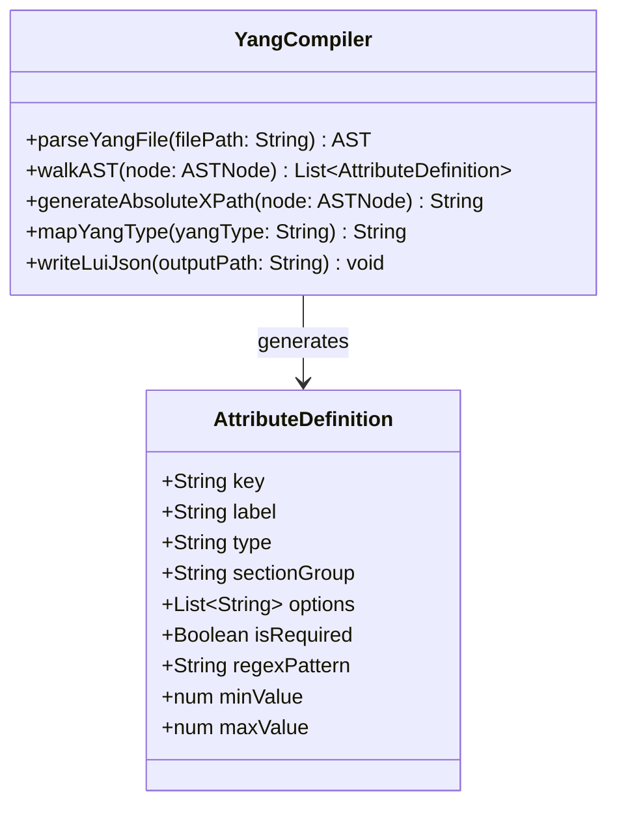

# Feature: YANG-to-JSON Build-Time Schema Compiler

## Parent Epic
- [ ] #[EpicID] - [Epic Title](https://github.com/gintatkinson/digital-pipeline-repo/blob/master/docs/epics/epic-XX-name.md) (semantic linkage justification)

## Description
Details the DevOps compilation pipeline parsing OpenConfig YANG schemas into platform-agnostic JSON schemas mapping types, lists, leaves, ranges, and patterns with absolute XPaths as keys.

## UML Class/Component Diagram


## Interface Requirements
### 1. Payload Schema
The output JSON schema (`logical-layout.json`) is structured as a collection of AttributeDefinitions:
```json
{
  "attributes": [
    {
      "key": "interfaces/interface/state/mtu",
      "label": "Mtu",
      "type": "int",
      "sectionGroup": "interfaces/interface/state",
      "isRequired": false,
      "minValue": 68,
      "maxValue": 65535
    }
  ]
}
```

### 3. Logical Operations & Interface Messages
1. The DevOps CI/CD pipeline triggers the schema compiler script.
2. The script loads OpenConfig YANG schemas (`.yang` files).
3. The parser walks the YANG Abstract Syntax Tree (AST).
4. Container and list constructs are mapped to UI section groups.
5. Leaf constructs are mapped to data-bound form inputs, mapping type declarations, mandatory status, ranges, and patterns.
6. The absolute XPath is set as the unique identifier (`key`) for each mapped attribute.
7. The compiled platform-agnostic JSON layout is saved to disk for runtime consumption.

### 4. Logical Exception States & Validation Failures
1. YANG Syntax Error: If the source `.yang` file contains semantic or syntactic errors, the compiler prints compilation diagnostics to stdout and exits with code 1, halting the build.
2. Duplicate XPath: If two leaves resolve to the same absolute XPath, the compiler flags a duplication exception and aborts.
