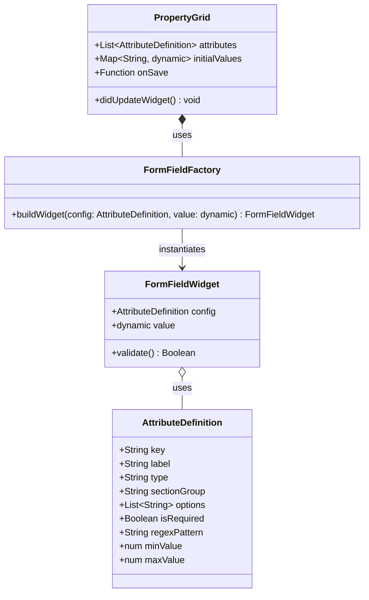

# Feature: Zero Code-Gen Dynamic PropertyGrid Adapter

## Parent Epic
- [ ] #[EpicID] - [Epic Title](https://github.com/gintatkinson/digital-pipeline-repo/blob/master/docs/epics/epic-XX-name.md) (semantic linkage justification)

## Description
Details the generic property grid presentation shell reading JSON schemas at runtime and dynamically instantiating input widgets.

## UML Class/Component Diagram


## Interface Requirements
### 1. Payload Schema
Uses the output schema of the compiler (`logical-layout.json`) loaded dynamically at startup:
```json
{
  "attributes": [
    {
      "key": "interfaces/interface/state/mtu",
      "label": "Mtu",
      "type": "int",
      "sectionGroup": "interfaces/interface/state",
      "isRequired": false,
      "minValue": 68,
      "maxValue": 65535
    }
  ]
}
```

### 3. Logical Operations & Interface Messages
1. UI launches and loads the dynamic JSON layout schema mapping attributes.
2. `PropertyGrid` is initialized with the attributes list and initial values map.
3. `FormFieldFactory` walks the configuration list and instantiates form widgets depending on `type` (e.g., `Dropdown` for enum, `TextField` for string, `NumberField` for double/int).
4. Focus listeners handle focus acquisition and focus loss (blur).
5. Dynamic input changes update local state and validate inputs against `isRequired`, `regexPattern`, `minValue`, and `maxValue` constraints.
6. Focus-loss triggers the `onSave` callback to write the validated delta back to the local database repository.

### 4. Logical Exception States & Validation Failures
1. Out of Bounds Value: If a numeric input violates `minValue` or `maxValue`, validation fails, error feedback is highlighted on the widget, and saving is blocked.
2. Invalid Pattern: If string input fails the `regexPattern` match, input is flagged as invalid, and focus-loss saving is bypassed or logs validation failure.
