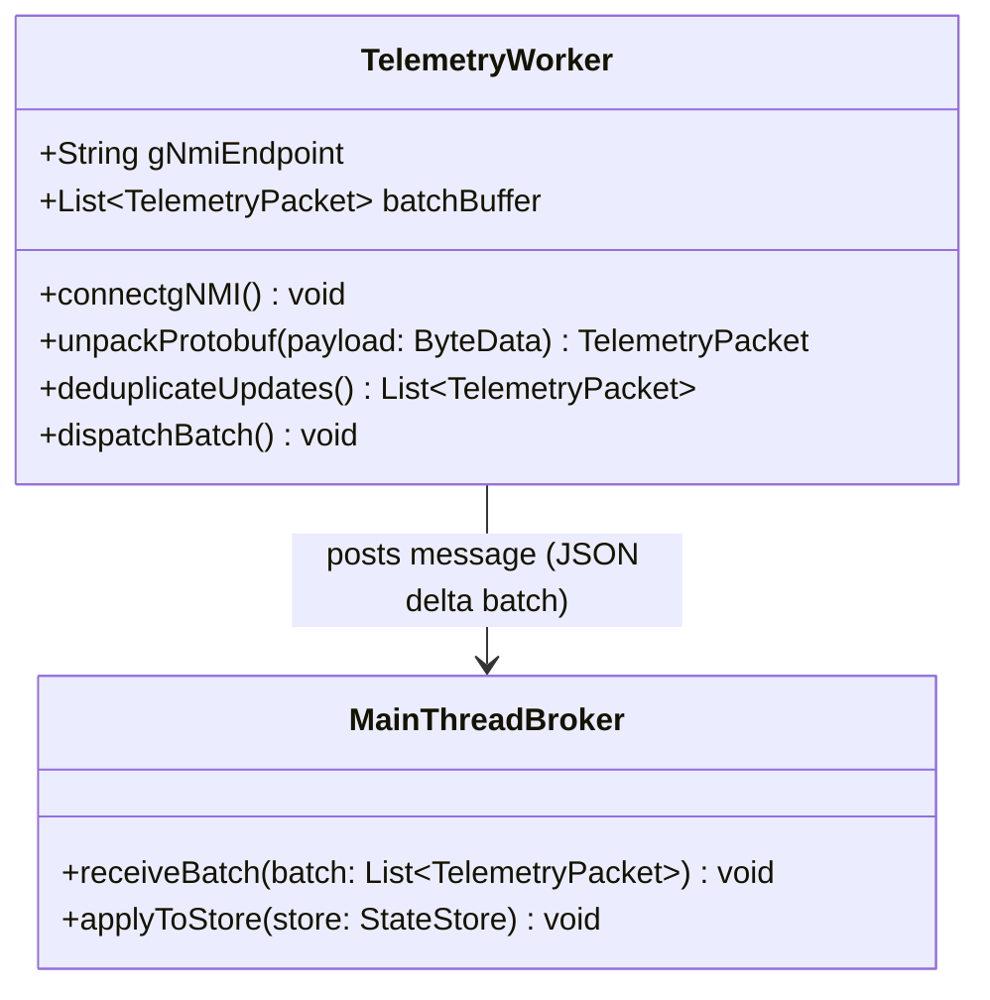

# Feature: Off-Thread Telemetry Processing and Worker Isolation

## Parent Epic
- [ ] #[EpicID] - [Epic Title](https://github.com/gintatkinson/digital-pipeline-repo/blob/master/docs/epics/epic-XX-name.md) (semantic linkage justification)

## Description
Details the background worker/isolate implementation, unpacking gNMI streams and micro-batching deduplicated updates every 100ms.

## UML Class/Component Diagram


## Interface Requirements
### 1. Payload Schema
The background worker delivers a flattened, deduplicated array of XPaths and values:
```json
{
  "timestamp": "2026-06-24T22:00:00Z",
  "deltas": [
    {
      "xpath": "interfaces/interface/state/admin-status",
      "value": "UP"
    },
    {
      "xpath": "interfaces/interface/state/counters/in-octets",
      "value": 10294819
    }
  ]
}
```

### 3. Logical Operations & Interface Messages
1. The application starts up and registers the Web Worker (React) or spawns the Dart Isolate (Flutter).
2. The background thread establishes a gNMI telemetry stream connection.
3. Raw Protobuf packets flow continuously into the background worker.
4. The worker unpacks the Protobuf binary packets into dynamic struct payloads without blocking the main UI thread.
5. Telemetry packets are appended to an internal buffer list.
6. Every 100ms, a timer triggers: the worker deduplicates keys (keeping only the latest value for any given XPath), serializes the batch into a JSON delta, and sends it to the main thread.
7. The main thread receives the batch and updates the client-side state store in one single write transaction.

### 4. Logical Exception States & Validation Failures
1. Worker Crash: If the background thread encounters an unhandled runtime error, it alerts the main thread to spawn a recovery worker and attempts reconnection.
2. Buffer Overflow: If incoming telemetry rates exceed memory allocation, the worker triggers an immediate drop-oldest policy, logs warnings, and flushes the current queue to the main thread.
