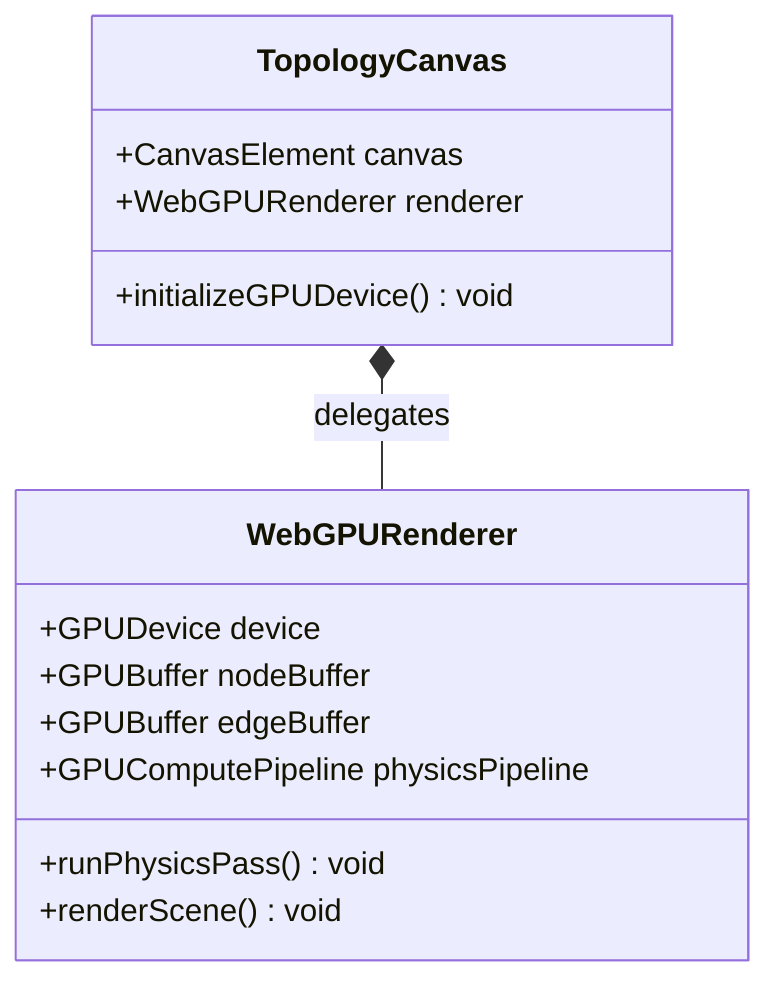

# Feature: GPU-Accelerated Topology Canvas

## Parent Epic
- [ ] #[EpicID] - [Epic Title](https://github.com/gintatkinson/digital-pipeline-repo/blob/master/docs/epics/epic-XX-name.md) (semantic linkage justification)

## Description
Details WebGPU/Impeller compute shaders mapping nodes and connections directly in GPU VRAM, bypassing the CPU thread.

## UML Class/Component Diagram


## Interface Requirements
### 1. Payload Schema
Input binary buffer layout uploaded directly to GPU memory (VRAM):
```c
struct Node {
    float x;
    float y;
    float dx;
    float dy;
    uint alarmSeverity;
};
```

### 3. Logical Operations & Interface Messages
1. The canvas component initializes and obtains a WebGPU device context or Impeller graphics instance.
2. Coordinates and edge structures for the entire network topology are loaded into local memory buffers.
3. The arrays of node coordinates, connectivity links, and active alarm severities are copied directly into GPU VRAM (WebGPU/Impeller Storage Buffers).
4. For node force-directed layout updates, the coordinate computing is delegated entirely to WebGPU/Impeller Compute Shaders.
5. Zoom and pan actions update uniform transformation matrices on the GPU without rewriting the individual node coordinates.
6. The scene is drawn in the render pass directly from the GPU storage buffers, leaving the CPU main thread free for UI events.

### 4. Logical Exception States & Validation Failures
1. WebGPU Unsupported: If the browser or host environment lacks GPU compute support, the renderer falls back gracefully to a basic 2D Canvas or SVG representation, emitting warnings to the console.
2. Shader Compilation Failure: If the WGSL or GLSL compute shader fails to compile, the component stops rendering, logs shader compiling diagnostics, and displays a fallback canvas warning to the user.
