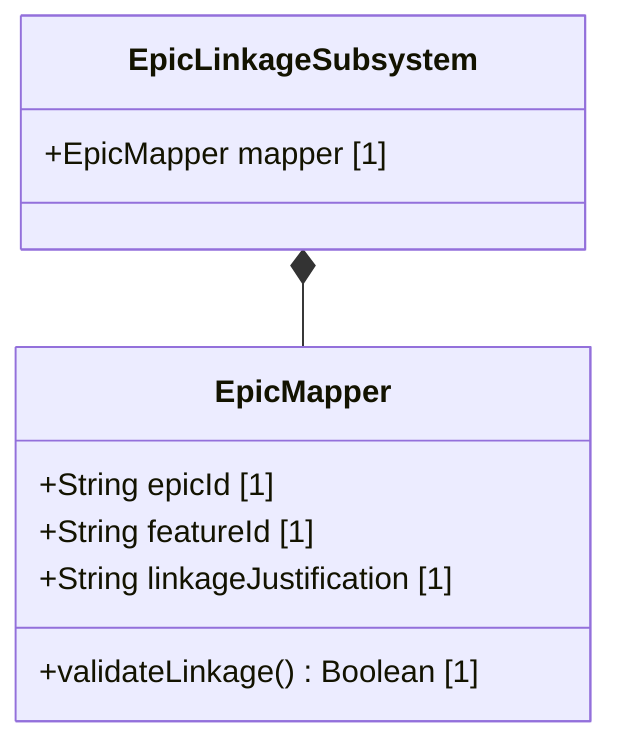

# Feature Gap: Dynamic Parent Epic linkage in Feature/Story/UseCase body text

## UML Class Diagram


## Interface Requirements

### 1. Payload Schema
Epic mapping and linkages are structured using:
```json
{
  "epicId": "epic-02-core-types",
  "featureId": "feat-03-dynamics-temporal",
  "linkageJustification": "Maps core dynamics feature to temporal tracking epic."
}
```

### 3. Logical Operations & Interface Messages
1. Retrieve epic metadata from target specification documents.
2. Verify linkage syntax structures inside the specification text body.
3. Validate that features are linked to registered parent epic instances.

### 4. Logical Exception States & Validation Failures
1. Missing Epic Linkage: If a specification file lacks the required parent epic reference, a warning is raised and the verification gate fails.
2. Invalid Epic Reference ID: If the linked epic ID does not resolve to any known registered epic, an exception is flagged.
