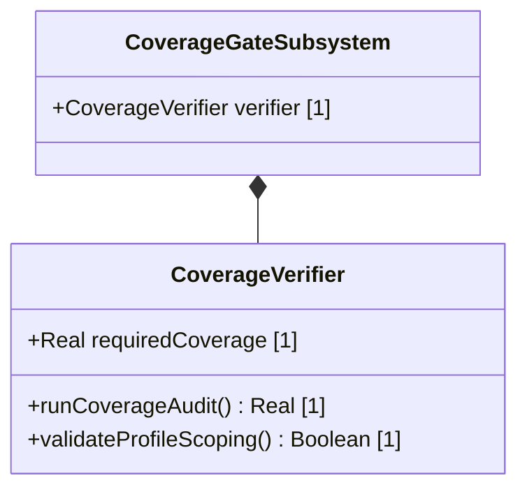

# Feature: Automated Schema and Profile Coverage Verification Gate

## UML Class Diagram


## Interface Requirements

### 1. Payload Schema
Coverage verification metrics are structured as:
```json
{
  "requiredCoverage": 1.0,
  "actualCoverage": 0.85,
  "isPassing": false
}
```

### 3. Logical Operations & Interface Messages
1. Retrieve active project UML definitions.
2. Scan target source code AST nodes for declaration mappings.
3. Compute overall model coverage parity ratio and verify it meets threshold gates.

### 4. Logical Exception States & Validation Failures
1. Missing Target Directory: If source codebase files are entirely missing, coverage fails automatically with code 1.
2. Under-Coverage Rejection: If calculated coverage is less than 1.0 (100%), the verification gate rejects the build.
