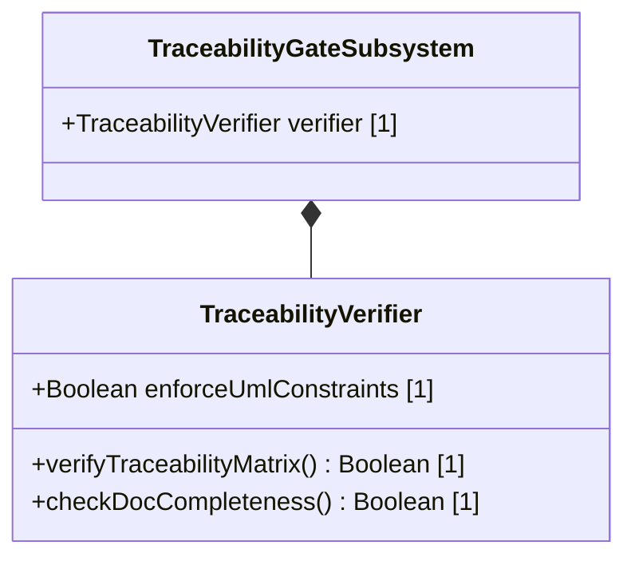

# Feature: Automated Self-Documentation and UML Traceability Verification Gate

## UML Class Diagram


## Interface Requirements

### 1. Payload Schema
Traceability validation records are structured as:
```json
{
  "enforceUmlConstraints": true,
  "matrixStatus": "COMPLETE",
  "missingLinksCount": 0
}
```

### 3. Logical Operations & Interface Messages
1. Retrieve registered issue list from the remote tracking system.
2. Read local specification documents and trace mapping links.
3. Validate traceability matrix to check for any orphaned stories or missing spec sheets.

### 4. Logical Exception States & Validation Failures
1. Orphaned Feature Detected: If a registered feature lacks a matching specification document, the audit registers a violation.
2. Collision in Indices: If multiple specs claim the same feature prefix number, the verifier aborts execution.
