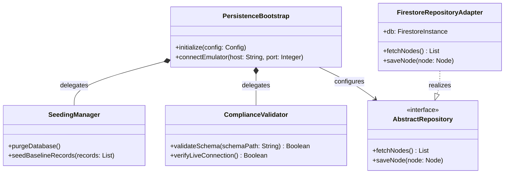

# Feature 44: Downstream Baseline Seeding and Compliance Framework

## UML Class Diagram


## Interface Requirements

### 1. Test Data Shape
```json
{
  "bootstrapConfig": {
    "emulatorHost": "127.0.0.1",
    "emulatorPort": 8080,
    "projectId": "demo-local-topology",
    "persistenceAdapter": "FirestoreRepositoryAdapter"
  },
  "baselineRecords": [
    {
      "id": "node-01",
      "name": "Tokyo-Gateway-01",
      "latitude": 35.6762,
      "longitude": 139.6503,
      "height": 40.5,
      "status": "Active"
    }
  ]
}
```

### 2. Standalone Seeding & Initialization
- **Automated Bootstrap**: At application startup, the bootstrapping mechanism reads the dynamic environment settings to resolve the active persistence adapter.
- **Background Execution**: In the test profile, the local database/emulator must run in the background. The setup process executes a seeding script to inject initial node configurations.
- **Offline Reliability**: The seeding and compliance validation must operate completely offline, using local emulator connections with no dependencies on cloud credentials.

### 3. Compliance & Structural Validation
- **Zero-Mocking Validation**: The runtime validation gate ensures that in-memory mock adapters are prohibited in live deployment contexts.
- **Off-Thread Processing**: Data serialization and schema validation of seeded records are executed in a decoupled background context to avoid UI thread blocking.
- **Coverage Checks**: Verification tools ensure that the baseline data conforms strictly to the schemas defined in the project configuration.

### 4. Interactive Flow & States

#### Scenario 1: Standalone Persistence Bootstrapping with Local Emulator
- **Given** the persistence framework is initialized with a stack configuration pointing to a local database emulator on host "127.0.0.1" and port 8080.
- **When** the application bootstrap sequence is executed.
- **Then** the framework establishes a connection to the local emulator, registers the active persistence adapter, and verifies the repository interface is ready.

#### Scenario 2: Bootstrap Fails on Unreachable Emulator
- **Given** the persistence framework is configured to connect to a local database emulator on port 8080.
- **When** the emulator service is offline and the application bootstrap sequence is triggered.
- **Then** the framework catches the connection failure, raises a boot compliance error, and prevents the presentation layer from loading.

#### Scenario 3: Automated Database Purge and Seeding
- **Given** the migration manager is initialized and the local emulator contains legacy test records.
- **When** the standalone seeding script is executed prior to runtime launch.
- **Then** the manager purges all existing collection records, inserts the baseline node configuration records, and logs a successful seeding completion signal.

#### Scenario 4: Enforcement of Zero-Mocking Compliance Gate
- **Given** the application is compiled under a live persistence profile configuration.
- **When** a component attempts to register an in-memory mock persistence repository adapter.
- **Then** the dependency injection bootstrap gate rejects the registration and halts application initialization with a zero-mocking policy violation.

#### Scenario 5: Data Model Schema Validation on Seeded Node Attributes
- **Given** a baseline data model containing geographical coordinates is defined.
- **When** the seeding manager attempts to write a record with a latitude of 95.0 (exceeding the standard limit of 90.0).
- **Then** the database schema validation rejects the write, throws a validation constraint error, and aborts the migration sequence.

---

## Source References
- **Project Constitution**: [constitution.md:L88-94](file:///Users/perkunas/digital-pipeline-repo/.pipeline/constitution.md#L88-L94) (Section 1.9 Zero-Mocking Live Persistence Mandate)
- **Project Constitution**: [constitution.md:L196-203](file:///Users/perkunas/digital-pipeline-repo/.pipeline/constitution.md#L196-L203) (Section 3.7 Strict Planning Mode Gate)
- **React Profile**: [react.md:L21-30](file:///Users/perkunas/digital-pipeline-repo/.pipeline/profiles/react.md#L21-L30) (Section 1 General Architecture & Platform Rules)
- **React Profile**: [react.md:L36-44](file:///Users/perkunas/digital-pipeline-repo/.pipeline/profiles/react.md#L36-L44) (Section 2 Coding Standards & UI Patterns)
