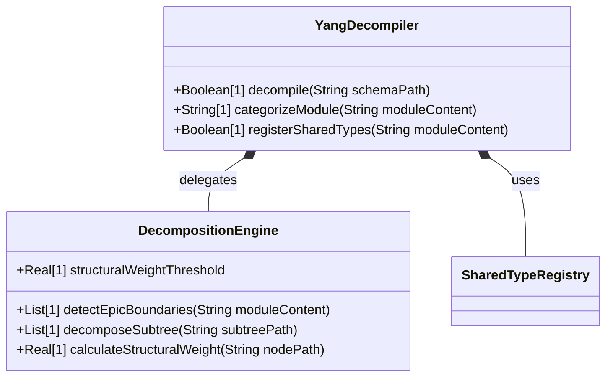

# Feature 45: YANG Schema Decomposition Heuristics

## Parent Epic
- [ ] #36 - Common YANG Data Types (RFC 9911)(https://github.com/gintatkinson/digital-pipeline-repo/blob/main/docs/epics/epic-36-common-yang-types.md) (Provides the target common YANG types module that must be parsed, analyzed, and decomposed into structured Epics and Features according to module-level boundaries)

## Description
This feature defines the rules and heuristics for decomposing a YANG schema module into a structured Agile backlog of Epics and Features. To avoid over-decomposition (e.g., splitting a single utility type module into 5 separate Epics), the decompiler uses heuristics to distinguish utility modules from functional modules and applies AST-driven partitioning when functional modules exceed defined structural weight thresholds.

## UML Class Diagram


## Interface Requirements

### 1. Payload Schema
```json
{
  "request": {
    "moduleName": "ietf-common-types",
    "schemaPath": "/Users/perkunas/jail/digital-pipeline-repo/schema/ietf-common-types.yang",
    "heuristics": {
      "structuralWeightThreshold": 20.0,
      "maxFeaturesPerEpic": 15,
      "maxAcsPerFeature": 10
    }
  },
  "response": {
    "moduleCategory": "utility",
    "generatedEpicsCount": 0,
    "sharedTypesRegistered": [
      "counter64",
      "gauge32",
      "date-and-time"
    ]
  }
}
```

### 2. Validation & Constraints
- **SW (Structural Weight) Threshold**: Default value is `20.0`. A subtree with a cumulative structural weight exceeding this value is partitioned into a separate Feature/Epic boundary.
- **Max Features per Epic**: Must be `<= 15`. If decomposition produces more than 15 features under a single Epic, the Epic must be split.
- **Max ACs per Feature**: Must be `<= 10`. Features must contain between 3 and 10 acceptance criteria (BDD scenarios).
- **Leaf/Depth Limits**: Functional modules with leaf counts `<= 40` and depth `<= 3` map to exactly `1` Epic.

### 3. Logical Operations & Interface Messages
1. **categorizeModule**: Classifies a YANG module as either a "utility" (typedefs/identities only) or "functional" module.
2. **detectEpicBoundaries**: Identifies candidate subtrees for Epic boundaries based on module complexity.
3. **decomposeSubtree**: Partitions a massive module subtree into independent Features.
4. **calculateStructuralWeight**: Computes structural weight for a node as: `Weight = leafCount + (depth * 2) + choicePenalty(5)`.

### 4. Logical Exception States & Validation Failures
1. **InvalidYANGSchemaException**: Raised when the input YANG schema fails syntactic parsing or has unresolved external imports.
2. **HeuristicConfigViolationException**: Raised if heuristic constraints (e.g. max features per Epic > 15) cannot be resolved.
3. **CircularDependencyException**: Raised if circular imports are detected between schema submodules.

## Given-When-Then Acceptance Criteria

### Scenario 1: Parsing Utility Module Cataloged to Shared Type Registry
- **Given** the YANG decompiler is initialized with a module containing only typedef and identity definitions.
- **When** the decompiler parses the module.
- **Then** all defined types are cataloged into the Shared Type Registry, and no new Epic specification files are generated.

### Scenario 2: Small Functional Module Maps to Exactly One Epic
- **Given** the YANG decompiler is initialized with a functional module having a leaf count of 35 (<= 40) and maximum depth of 2 (<= 3).
- **When** the decompiler parses the module.
- **Then** exactly 1 Epic specification file is generated, containing all features mapped under that single Epic.

### Scenario 3: Massive Functional Module Partitioned into Multiple Epics
- **Given** the YANG decompiler is initialized with a functional module having a leaf count of 120 (> 40) or maximum depth of 5 (> 3).
- **When** the decompiler parses the module.
- **Then** the module is partitioned across logical subtree boundaries, generating multiple separate Epic specification files.

### Scenario 4: Subtree Partitioning on Structural Weight Threshold Exceeded
- **Given** the YANG decompiler is traversing a YANG module AST and calculates the structural weight of a subtree to be 25 (> 20).
- **When** the decompiler applies the partitioning heuristics.
- **Then** the decompiler splits the subtree at that boundary and generates a separate Feature specification for the subtree.

## Specification Context (Verbatim)
RFC 7950 Section 5.1: "YANG modeling style recommends grouping data nodes logically to represent distinct Bounded Contexts. When a module definition serves primarily as a dictionary of reusable types, compiler implementations must avoid generating functional epics for every nested type leaf. Instead, the type definitions must populate a central registry, reserving the functional backlog exclusively for state-bearing operational data nodes."

## 4. Source References
Structural Schema: `schema/ietf-common-types.yang`
Normative Specification: [RFC 7950 - YANG 1.1 Data Modeling Language](https://tools.ietf.org/html/rfc7950)

## 5. Logical UI & Layout Bindings
- **Target LUI Component:** PropertyGrid
- **Target Layout Container ID:** topology_pane
- **Data Source Bindings:** `/api/v1/decompiler/jobs`
