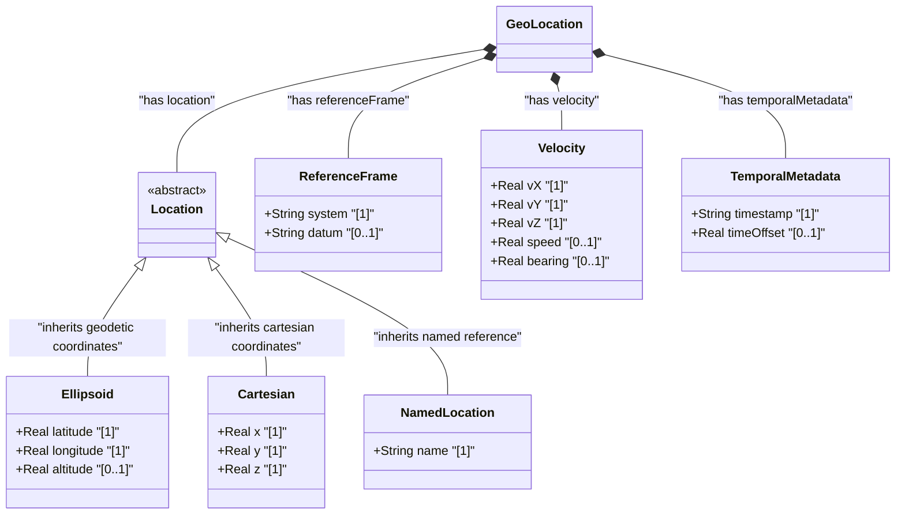

# Functional Solution Blueprint — Dynamic Geolocation & Motion Telemetry

## 1. Context & Scope

This blueprint defines the platform-independent functional specification for modeling, representing, and verifying dynamic geolocation and motion telemetry for moving platforms. Kinetic tracking requires unified reference systems, precise velocity vector representations, and temporal metadata capable of scaling across diverse environments, from terrestrial networks to deep space operations.

To support multi-domain operations, this specification establishes a polymorphic data metamodel that accommodates five transport domains:
- **Rail Systems**: 1D Linear Referencing Systems (LRS) aligned with 3D geodetic coordinates.
- **Road Vehicles**: Urban canyon operations with dynamic satellite signal degradation (HDOP/VDOP).
- **Marine Vessels**: Nautical trajectories with dynamic tidal offsets and elevation models.
- **Aircraft**: High-frequency 3D flight paths featuring rapid vertical velocity variations.
- **Spacecraft**: Extraterrestrial orbital trajectories using planetocentric Cartesian coordinates.

---

## 2. Structural Metamodel (UML Class Diagram)

The following class diagram defines the logical schema for geolocation, reference frames, and motion vectors. Polymorphic location types support standard ellipsoidal coordinates, planetary Cartesian offsets, and named topology markers.

---

## 3. Transport Domain Specifications

### 3.1 Rail Use Case (Linear & Geodetic Alignment)
Rail transportation utilizes 1D Linear Referencing Systems (LRS) to track assets along physically constrained lines. Telemetry reports must correlate 1D track kilometer offsets (stationing) with 3D geodetic latitude, longitude, and ellipsoidal height to enable precise asset tracking, switch positioning, and maintenance mapping.
- **Reference Frame**: Geodetic system (WGS-84) aligned with a linear track network database.
- **Data Attributes**: 
  - Track ID (string identifier)
  - Kilometer Marker (1D track offset in meters)
  - Lateral Offset (distance from center line in meters)
  - 3D Geodetic coordinates for validation.
- **Constraints**: 1D linear coordinates must periodically reconcile with 3D GPS track points, flagging any spatial discrepancy that exceeds track clearance envelopes (typically +/- 1.5 meters).

### 3.2 Vehicle Use Case (Urban Canyon Precision Degradation)
Automotive tracking in high-density urban corridors ("urban canyons") suffers from multipath propagation, satellite signal blockage, and severe signal attenuation. To maintain location trust, telemetry streams must capture dynamic Dilution of Precision (DOP) metrics and coordinate accuracy variance.
- **Reference Frame**: Geodetic WGS-84 with dynamic error ellipse parameters.
- **Data Attributes**:
  - Latitude, Longitude, Altitude
  - Horizontal Dilution of Precision (HDOP)
  - Vertical Dilution of Precision (VDOP)
  - Position Uncertainty (standard deviation in meters)
- **Constraints**: If HDOP exceeds 4.0 or VDOP exceeds 6.0, position telemetry must be marked as "degraded," initiating dead reckoning or alternative localization heuristics.

### 3.3 Marine Use Case (Vessel Navigation & Tidal Offsets)
Nautical tracking must adjust for tidal height variations and draft clearance. Vertical measurements require explicit sea level datums (such as Mean Lower Low Water - MLLW) to calculate net under-keel clearance, while 3D velocity vectors record Speed Over Ground (SOG) and Course Over Ground (COG).
- **Reference Frame**: WGS-84 for horizontal positioning, referencing vertical datums like MLLW or MSL (Mean Sea Level).
- **Data Attributes**:
  - Geodetic position (Latitude, Longitude)
  - Dynamic Draft (keel depth relative to waterline)
  - Tidal Offset (dynamic water height variation relative to local datum)
  - Velocity Vector ($v_X, v_Y, v_Z$) representing drift, heave, and forward speed.
- **Constraints**: Absolute altitude must be adjusted dynamically using the tidal offset to verify keel clearance against known bathymetric depth charts.

### 3.4 Air Use Case (Flight Dynamics & Vertical Rate)
Aviation telemetry handles high-velocity 3D dynamics where vertical displacement rate is a critical safety parameter. Telemetry feeds must record barometric altitude, GNSS altitude, and high-frequency vertical velocity ($v_{Up}$ or climb/sink rate) along with spatial attitude angles.
- **Reference Frame**: WGS-84 for geodetic tracking; ICAO Standard Atmosphere for barometric pressure altitude.
- **Data Attributes**:
  - Geodetic position (Latitude, Longitude, GNSS Altitude)
  - Pressure Altitude (feet or meters relative to 1013.25 hPa)
  - Vertical Velocity ($v_{Up}$ in meters per second)
  - Yaw, Pitch, Roll angles (attitude indicators)
- **Constraints**: High-frequency updates (minimum 10 Hz) for vertical velocity vectors to prevent resolution latency during rapid ascent/descent phases.

### 3.5 Space Use Case (Planetary Orbit Cartesian Dynamics)
Orbital trajectories around celestial bodies (Earth, Moon, Mars) operate beyond geodetic coordinate utility. Telemetry utilizes inertial Cartesian coordinate frames (centered on the target celestial body) and high-precision velocity vectors relative to specific planetary epochs.
- **Reference Frame**: Earth-Centered Inertial (ECI - EME2000), Mars-Centered Inertial (MCI), or Moon-Centered Inertial (MCI) depending on the active orbital sphere of influence.
- **Data Attributes**:
  - Inertial Position Vectors ($X, Y, Z$ in meters)
  - Inertial Velocity Vectors ($v_X, v_Y, v_Z$ in meters per second)
  - Celestial body association (Earth, Moon, Mars)
  - Epoch timestamp (UTC or Barycentric Dynamical Time)
- **Constraints**: Coordinates are represented in double-precision floating-point formats ($X, Y, Z$) to prevent coordinate truncation errors in deep space.

---

## 4. Scenario Acceptance Criteria (Given-When-Then BDD)

### 4.1 Rail Position Reconciled with LRS Track Point
* **Given** a rail vehicle traveling on Track "TR-102" at Kilometer Marker 45.320.
* **When** a 3D GPS telemetry update is received with geodetic coordinates (Latitude: 35.6895, Longitude: 139.6917, Altitude: 42.1).
* **Then** the system must calculate the perpendicular distance from the geodetic point to the LRS track centerline database entry.
* **And** verify that the computed spatial discrepancy does not exceed the maximum allowed track envelope of 1.5 meters.

### 4.2 Urban Canyon Signal Degradation Detection
* **Given** a road vehicle transmitting position telemetry in a dense downtown district.
* **When** a telemetry update registers an HDOP of 5.2 and position uncertainty of 12.5 meters.
* **Then** the system must mark the geolocation status as "DEGRADED".
* **And** expand the active geospatial search and routing radius to encompass the 95% confidence error ellipse.

### 4.3 Marine Under-Keel Clearance Calculation
* **Given** a vessel navigating in a shallow channel with a dynamic draft of 8.5 meters.
* **When** water level telemetry indicates a local tide height of +1.2 meters relative to the MLLW datum.
* **Then** the system must compute the dynamic water column depth (bathymetric chart depth + tide height).
* **And** verify that the net under-keel clearance (water depth - draft) remains above the safe operating threshold of 2.0 meters.

### 4.4 Aircraft High-Frequency Vertical Velocity Update
* **Given** an aircraft operating in a high-rate climb maneuver at 10,000 feet.
* **When** GNSS and barometric sensors report a vertical velocity ($v_{Up}$) of +15.5 meters per second at a sampling rate of 10 Hz.
* **Then** the flight dynamics processor must update the projected altitude for the next 10-second interval.
* **And** trigger a climb alarm if the vertical velocity exceeds the envelope limit of +25.0 meters per second.

### 4.5 Spacecraft Orbit Keplerian Resolution
* **Given** a spacecraft orbiting Mars using the Mars-Centered Inertial (MCI) reference frame.
* **When** position and velocity vectors are queried ($X$: -1204000.0 m, $Y$: 3409000.0 m, $Z$: 1102000.0 m; $v_X$: -2100.0 m/s, $v_Y$: -950.0 m/s, $v_Z$: 1800.0 m/s).
* **Then** the system must convert the Cartesian coordinate vectors into standard Keplerian orbital parameters (Semi-major axis, Eccentricity, Inclination).
* **And** confirm the orbit is stable relative to Mars' gravity constants.

---

## 5. Source References

- **RFC 9179**: [YANG Grouping for Geographic Location](https://datatracker.ietf.org/doc/html/rfc9179) (February 2022).
- **WGS-84**: [World Geodetic System 1984](https://earth-info.nga.mil/)
- **ISO 6709**: [Standard representation of geographic point location by coordinates](https://www.iso.org/standard/39242.html)

---

## 6. Logical UI & Layout Bindings

- **Target LUI Component**: `PropertyGrid`
- **Target Layout Container ID**: `properties_view`
- **Data Source Bindings**: 
  - `GeoLocation.location` mapped to `properties_view.location_panel`
  - `GeoLocation.velocity` mapped to `properties_view.velocity_vectors`
  - `GeoLocation.referenceFrame` mapped to `properties_view.reference_system`
  - `GeoLocation.temporalMetadata` mapped to `properties_view.temporal_data`
