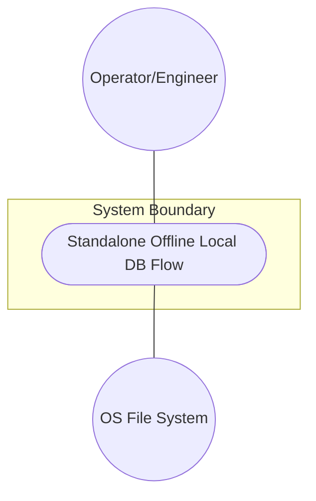
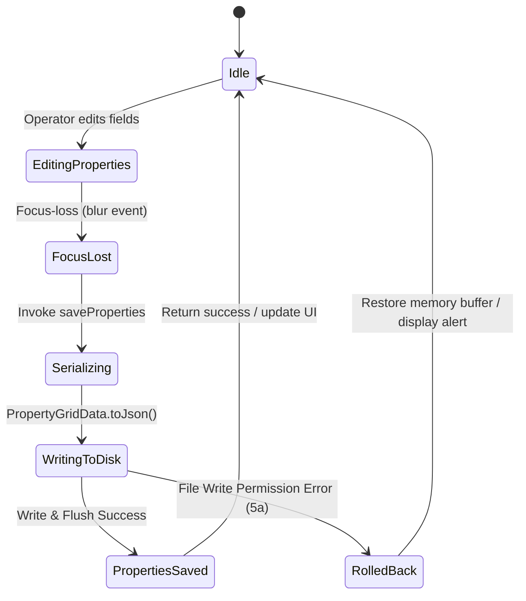

# Use Case: Standalone Offline Local DB Flow

## 1. Actors
- **Primary Actor:** Operator/Engineer
- **Secondary Actors:** OS File system

## 2. Preconditions
- App is launched in standalone configuration.
- SQLite FFI or JSON file DB is configured in user's App Data directory.

## 3. Trigger
Operator updates node properties in the Property Grid and shifts focus (blur event).

## 4. Main Success Scenario (Basic Flow)
1. Operator edits coordinate/attribute fields in the property grid UI.
2. UI triggers focus-loss (blur) event on field.
3. UI Component invokes `saveProperties` on the abstract repository interface.
4. `LocalFileRepositoryAdapter` handles the method call.
5. `LocalFileRepositoryAdapter` serializes data using `PropertyGridData.toJson()`.
6. `LocalFileRepositoryAdapter` writes JSON string to local file path and flushes data to disk.
7. `LocalFileRepositoryAdapter` returns success, and UI updates node status/visual feedback.

## 5. Alternate and Exception Flows
- **5a. File write permission error (Branches from step 6):**
  1. `LocalFileRepositoryAdapter` catches file system permission exception.
  2. System aborts write, logs warning, rolls back memory buffer, and displays alert to operator.
- **5b. Invalid node ID (Branches from step 4):**
  1. `LocalFileRepositoryAdapter` detects the nodeId does not exist in local registry.
  2. System creates a new node entry in the map, continues write, and alerts operator.

## 6. Postconditions (Guarantees)
- **Success Guarantee:** Node properties are successfully saved and persisted in the local SQLite/JSON DB on disk, and the UI displays node status as synchronized.
- **Failure Guarantee:** Local DB state is rolled back to the last known valid state, memory buffer is restored, warning is logged, and error notification is displayed to the operator.

## UML Diagrams
### Use Case Diagram

### State Machine Diagram

## 7. Operational Context
App is launched in standalone offline mode. Persistence is handled locally via SQLite FFI or JSON files directly written to the local disk workspace in the user's App Data directory.

## 8. Realization Matrix
### Required Features
- [ ] #44 - [Downstream Baseline Feature](https://github.com/gintatkinson/digital-pipeline-repo/blob/master/docs/features/feat-44-downstream-baseline.md) (Realizes property grid offline persistence baseline)

## Source References
Structural Schema: `docs/designs/persistence-architecture-blueprint.md`
Normative Specification: `docs/designs/persistence-architecture-blueprint.md`
