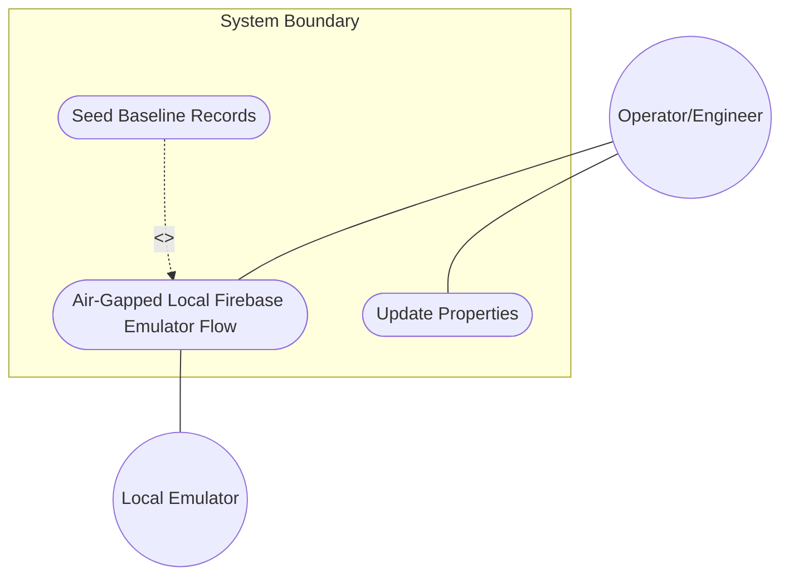
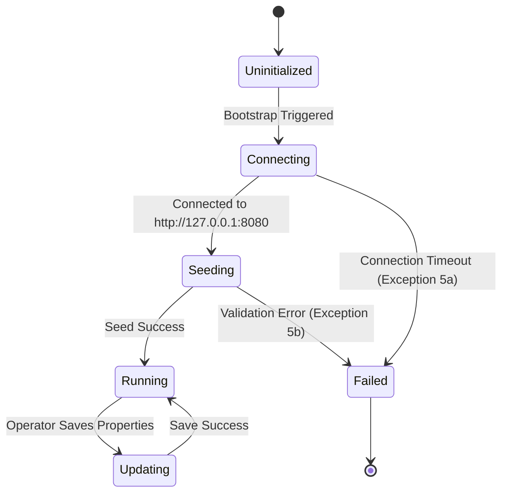

# Use Case: Air-Gapped Local Firebase Emulator Flow

## Parent Epic
- [ ] #43 - [Downstream Data Delivery and Local Persistence](https://github.com/gintatkinson/digital-pipeline-repo/blob/master/docs/epics/epic-43-downstream-delivery.md) (semantic linkage justification: Epic 43 governs downstream data delivery and local persistence design configurations, under which this local Firebase emulator flow is categorized.)

## 1. Actors
- **Primary Actor:** Operator/Engineer
- **Secondary Actor:** Local Emulator

## 2. Preconditions
- Firebase Emulator Suite is running locally (port 8080).
- App is configured for Local Emulator test profile.

## 3. Trigger
Application boot/bootstrap routine starts or Operator updates properties.

## 4. Main Success Scenario (Basic Flow)
1. Bootstrapping mechanism loads settings and initializes [FirestoreRepositoryAdapter](file:///Users/perkunas/digital-pipeline-repo/docs/designs/persistence-architecture-blueprint.md#L32-L37).
2. Adapter connects to local emulator suite sandbox at `http://127.0.0.1:8080`.
3. [SeedingManager](file:///Users/perkunas/digital-pipeline-repo/docs/features/feat-44-downstream-baseline.md#L29-L32) purges legacy test records from local database.
4. [SeedingManager](file:///Users/perkunas/digital-pipeline-repo/docs/features/feat-44-downstream-baseline.md#L29-L32) sends REST payloads to seed baseline records.
5. UI component queries the emulator database to fetch seeded nodes.
6. Operator updates properties and adapter saves them to the emulator.

## 5. Alternate and Exception Flows
- **5a. Emulator offline / Unreachable (Branches from Basic Flow step 2):**
  1. [FirestoreRepositoryAdapter](file:///Users/perkunas/digital-pipeline-repo/docs/designs/persistence-architecture-blueprint.md#L32-L37) detects a connection timeout or failure.
  2. System catches the connection failure, raises a boot compliance error, aborts the launch sequence, and displays the error console.
  *Guarantees:* Aborts launch, displays error console, rolls back to uninitialized state.
- **5b. Seed data validation constraints failed (Branches from Basic Flow step 4):**
  1. [SeedingManager](file:///Users/perkunas/digital-pipeline-repo/docs/features/feat-44-downstream-baseline.md#L29-L32) detects a schema validation constraint error (e.g. Latitude > 90.0).
  2. System rejects the database write operations, throws a validation constraint error, aborts seeding, and halts application startup.
  *Guarantees:* Rejects write, rolls back any partial database changes, halts startup, and notifies Operator.
- **5c. Zero-Mocking Policy Violation (Branches from Basic Flow step 1):**
  1. Dependency injection bootstrap gate detects registration of an in-memory mock repository adapter under a live or emulator persistence profile.
  2. System rejects adapter registration, throws zero-mocking policy violation error, and halts application initialization.
  *Guarantees:* Registration rejected, halts initialization, and notifies Operator.

## 6. Postconditions (Guarantees)
- **Success Guarantee:** Application successfully initialized, connection to local emulator suite sandbox established on port 8080, baseline records seeded, and UI displays active data nodes.
- **Failure Guarantee:** Bootstrap or seeding aborted, rollback of database state, operator notified via error console, application startup halted.

## UML Diagrams
### Use Case Diagram

### State Machine Diagram

## 7. Operational Context
### From Option 2: Air-Gapped Local Firebase Emulator
> Target Environment: Local testing, CI pipelines, and air-gapped developer environments where Firebase/Firestore APIs are functionally required for development parity but no active cloud connection is permitted.
> Mechanism:
> - Connects to a locally running instance of the Firebase/Firestore emulator (`http://127.0.0.1:8080`) over loopback.
> - Bypasses Google Cloud IAM and network credentials, using mock configuration environments.
> - Restores functional parity with the cloud build configuration (validating security rules, collections, queries) within an entirely offline local loop.

### From Configuration A: Testing Mode (Local Emulator)
> Target Environment: Developer local machines and automated CI pipelines.
> Mechanism:
> - Connects to the local Firestore Emulator running at `http://127.0.0.1:8080` via standard HTTP Fetch operations.
> - Pre-seeds baseline records at boot time via a lightweight `SeedingManager` REST payload, ensuring developers can test forms, splitters, and validations without requiring live Google Cloud access keys.

## 8. Realization Matrix
### Required User Stories
- [ ] #N/A - [Local Emulator Seeding Story](https://github.com/gintatkinson/digital-pipeline-repo/blob/master/docs/user-stories/us-placeholder.md) (not formally defined)
### Required Features
- [ ] #44 - [Feature 44: Downstream Baseline Seeding and Compliance Framework](https://github.com/gintatkinson/digital-pipeline-repo/blob/master/docs/features/feat-44-downstream-baseline.md) (implements the bootstrapping logic, SeedingManager database purge/restoration, and connection checks for the local emulator environment)

## Source References
Structural Schema: None defined.
Normative Specification: [Persistence Architecture Blueprint](file:///Users/perkunas/digital-pipeline-repo/docs/designs/persistence-architecture-blueprint.md)
