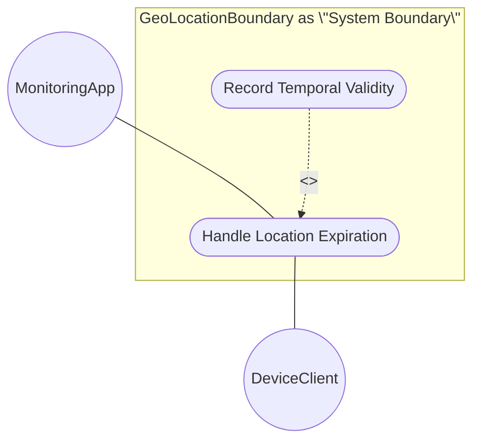
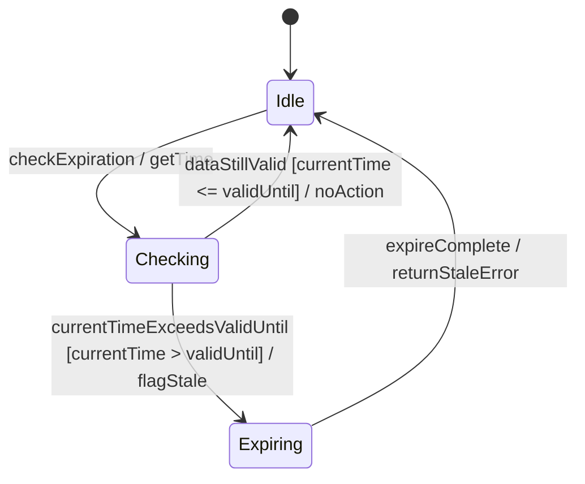

# Use Case: Handle Location Expiration

## 1. Actors
*   **Primary Actor**: `MonitoringApp`
*   **Secondary Actor**: `DeviceClient`

## 2. Preconditions
*   The subsystem has active location coordinates and an expiration timestamp `valid-until` recorded.

## 3. Trigger
The system time exceeds the `valid-until` timestamp or a client queries location when `currentTime` > `valid-until`.

## 4. Main Success Scenario
1. `MonitoringApp` or system checks the expiration status of location records.
2. Subsystem retrieves the `valid-until` timestamp.
3. Subsystem compares `currentTime` with `valid-until`.
4. Subsystem determines `currentTime` is greater than `valid-until`.
5. Subsystem updates status of location record to Expired.
6. Subsystem returns an error or warning indicating location data is stale.

## 5. Alternate and Exception Flows
*   **5a. Location Record without Expiration (Branches from Step 2):**
    1. Subsystem detects that no `valid-until` timestamp is set.
    2. Subsystem keeps the location status as Active indefinitely, returns the coordinates, and exits.
*   **5b. Location Updated Before Expiration (Branches from Step 3):**
    1. Subsystem receives a fresh location report from `DeviceClient` before `valid-until` is reached.
    2. Subsystem updates coordinates, resets the expiration timer, and remains in Active state.

## 6. Postconditions
*   **Success Guarantee**: Stale location records are correctly marked as Expired, and requests for stale data return errors.
*   **Failure Guarantee**: If checking fails, the last state is maintained, but query checks will reject stale returns on the fly.

## UML Diagrams

### Use Case Diagram

### State Machine Diagram

## 8. Realization Matrix

### Required User Stories
- [ ] #[IssueID] - Query Current Location(docs/user-stories/us-05-query-current-location.md) (provides query location scenario)
- [ ] #[IssueID] - Expire Geo-Location(docs/user-stories/us-07-expire-geo-location.md) (provides automatic expiration transition scenario)

### Required Features
- [ ] #[IssueID] - Record Temporal Validity(docs/features/feat-05-temporal-validity.md) (defines temporal validation attributes)

## Source References
Structural Schema: [ietf-geo-location.yang](schema/ietf-geo-location.yang)
Normative Specification: [RFC 9179](https://datatracker.ietf.org/doc/html/rfc9179)
