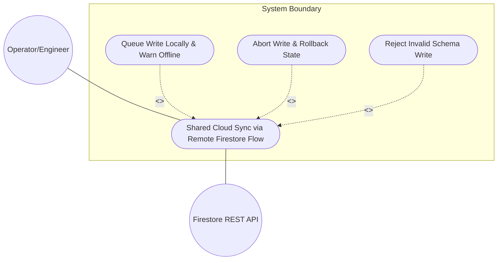
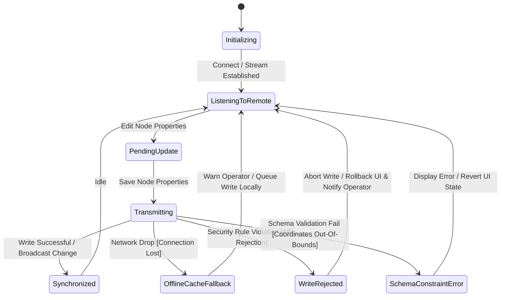

# Use Case: Shared Cloud Sync via Remote Firestore Flow

## Parent Epic
- [ ] #0 - Standalone Persistence Epic (https://github.com/gintatkinson/digital-pipeline-repo/blob/master/docs/epics/epic-00-persistence.md) (Aggregates all persistence layers and adapters for React and Flutter desktop configurations)

## 1. Actors
- **Primary Actor:** Operator/Engineer
- **Secondary Actors:** Firestore REST API

## 2. Preconditions
- Workstation has active network connection.
- App is configured with valid Firebase project credentials/API keys.

## 3. Trigger
Operator opens the collaborative monitor console or performs updates.

## 4. Main Success Scenario (Basic Flow)
1. UI connects to production Firestore database using `FirestoreRepositoryAdapter`.
2. Adapter establishes listener stream to remote collections (`properties`).
3. Operator edits node coordinates/properties.
4. `FirestoreRepositoryAdapter` sends REST/gRPC write request to Firestore REST API.
5. Firestore database processes update and broadcasts change to all active monitors.
6. Collaborative consoles receive change notification and repaint the canvas.

## 5. Alternate and Exception Flows
- **5a. Network Drop / Connection Lost (Branches from Basic Flow step 4):**
  1. `FirestoreRepositoryAdapter` detects network connection loss.
  2. System falls back to offline cache, queues the write locally, and warns operator of offline state.
- **5b. Security Rule Violation (Branches from Basic Flow step 4):**
  1. Firestore REST API rejects write due to permission/security rule failure.
  2. System aborts write, clears queued change, notifies operator of authorization failure, and rolls back UI state.
- **5c. Data Model Schema Constraint Violation (Branches from Basic Flow step 4):**
  1. Firestore REST API or local adapter schema validation detects coordinate or property out-of-bounds error.
  2. System rejects write, displays constraint error message to the operator, and reverts UI inputs to the last valid state.

## 6. Postconditions (Guarantees)
- **Success Guarantee:** Node properties are successfully persisted in the remote cloud database, and all active collaborator consoles are updated and repainted in real-time.
- **Failure Guarantee:** Any failed write transaction is aborted, the UI state is rolled back to prevent visual drift, the operator is notified of the specific error, and the database integrity is maintained.

## UML Diagrams
### Use Case Diagram


### State Machine Diagram


## 7. Operational Context
```
The React baseline (web_react) acts as the web-based console interface. It supports two primary deployment profiles:
Configuration B: Production Mode (Cloud Firestore)
- Target Environment: Live hosted environments (Firebase App Hosting or Google Cloud Run).
- Mechanism:
  - Connects to the live Google Cloud Firestore production instance over HTTPS/WSS.
  - Enforces strict read/write security rules (checking user authentication tokens) and encrypts all telemetry data in transit.
```

## 8. Realization Matrix
### Required User Stories
- [ ] #0 - Collaborative Console Updates (https://github.com/gintatkinson/digital-pipeline-repo/blob/master/docs/user-stories/us-03-collaborative-sync.md) (Verifies that operator actions are real-time broadcasted to other connected clients)
### Required Features
- [ ] #44 - Downstream Baseline Seeding and Compliance Framework (https://github.com/gintatkinson/digital-pipeline-repo/blob/master/docs/features/feat-44-downstream-baseline.md) (Establishes the concrete FirestoreRepositoryAdapter and compliance verification checks)

## Source References
Structural Schema: [persistence-architecture-blueprint.md:L75-80](file:///Users/perkunas/digital-pipeline-repo/docs/designs/persistence-architecture-blueprint.md#L75-L80)
Normative Specification: [constitution.md:L88-94](file:///Users/perkunas/digital-pipeline-repo/.pipeline/constitution.md#L88-L94) (Section 1.9 Zero-Mocking Live Persistence Mandate)
