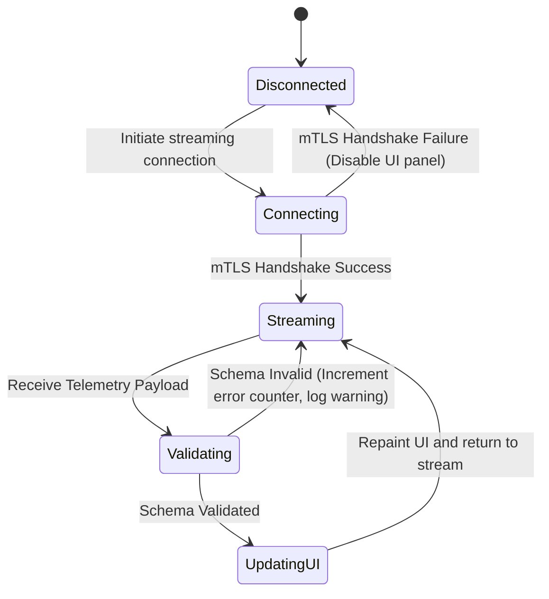

# Use Case: High-Performance Equipment Telemetry via gNMI/Protobuf Flow

## 1. Actors
- **Primary Actor:** Operator/Engineer
- **Secondary Actor:** gNMI Sockets

## 2. Preconditions
- App is configured under live telemetry profile.
- Telemetry endpoint gRPC channel is open with mTLS authentication.

## 3. Trigger
gNMI router interface stream pushes coordinate, node properties, or alarm updates.

## 4. Main Success Scenario (Basic Flow)
1. `gNMIProtobufRepositoryAdapter` establishes a streaming gRPC connection to gNMI Sockets.
2. gNMI socket streams telemetry payloads encoded as Protobuf defined by OpenConfig.
3. Adapter receives the telemetry state update containing alarms or interface statistics.
4. `ComplianceValidator` validates the payload schema.
5. Adapter maps telemetry state alerts to 6 JSR 90 Alarm Severity levels.
6. Adapter triggers canvas update and UI repaints node status.

## 5. Alternate and Exception Flows
- **5a. mTLS Authentication Failure (Branches from Basic Flow step 1):**
  1. gNMI Sockets rejects connection due to expired or missing client certificate.
  2. System aborts connection, throws TLS error, logs security event, and disables telemetry panel.
- **5b. Schema validation failure (Branches from Basic Flow step 4):**
  1. ComplianceValidator flags malformed protobuf packet or schema mismatch.
  2. System drops packet, increments error counter, and logs validation warning without affecting UI.

## 6. Postconditions (Guarantees)
- **Success Guarantee:** UI displays updated node status reflecting live alarm severity level and telemetry coordinates; streaming connection remains active.
- **Failure/Abort Guarantee:** System rolls back connection state to disconnected, notifies operator of the failure, and preserves prior valid state.

## UML Diagrams
### Use Case Diagram
```mermaid
graph TD
    subgraph "System Boundary"
        UC(["High-Performance Equipment Telemetry via gNMI/Protobuf Flow"])
        UC_Validate(["Validate Schema"])
    end
    Operator(("Operator/Engineer")) --- UC
    UC -. \"<<include>>\" .-> UC_Validate
    UC --- Sockets(("gNMI Sockets"))
```

### State Machine Diagram


## 7. Operational Context
Deployments utilize gNMI Protobuf streams over HTTP/2 transport to capture high-frequency equipment state updates and trigger real-time UI canvas repaints.

## 8. Realization Matrix
### Required Features
- [ ] #44 - [Feature 44: Downstream Baseline Seeding and Compliance Framework](https://github.com/gintatkinson/digital-pipeline-repo/blob/master/docs/features/feat-44-downstream-baseline.md) (Defines class topologies and validation gates for adapters, including ComplianceValidator)
- [ ] [Persistence Architecture Blueprint](docs/designs/persistence-architecture-blueprint.md) (Specifies gNMI/Protobuf repository adapter structure and Option 4 telemetry configuration)
