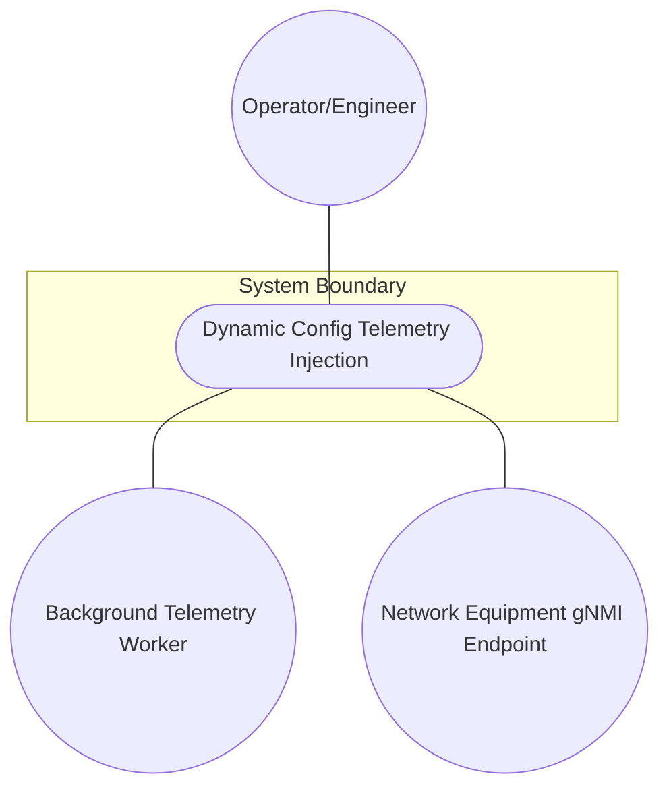
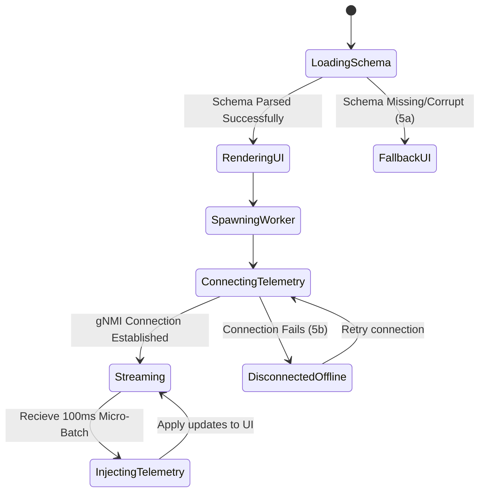

# Use Case: Dynamic Config Telemetry Injection

## 1. Actors
- **Primary Actor:** Operator/Engineer
- **Secondary Actors:** Background Telemetry Worker, Network Equipment gNMI Endpoint

## 2. Preconditions
- YANG schema has been compiled into `logical-layout.json` at build time.
- The UI application is launched.

## 3. Trigger
The application is launched and initializes the dynamic UI layout engine.

## 4. Main Success Scenario (Basic Flow)
1. The application parses the `logical-layout.json` file at startup.
2. The UI engine dynamically instantiates input fields, lists, and layout panels based on the JSON schema definition.
3. The application spawns the background Telemetry Worker thread (Web Worker / Dart Isolate).
4. The background Telemetry Worker establishes a connection to the network equipment gNMI endpoint.
5. gNMI Protobuf telemetry streams begin arriving at the background Telemetry Worker.
6. The worker unpacks the Protobuf stream payloads off the main thread.
7. Every 100ms, the worker flushes deduplicated dynamic state updates to the main thread.
8. The main UI thread injects these updates into the active form widgets without stealing keyboard focus from the Operator.

## 5. Alternate and Exception Flows
- **5a. Schema file missing or corrupt (Branches from step 1):**
  1. The system detects that `logical-layout.json` is missing or invalid.
  2. The application falls back to a minimal built-in diagnostic configuration UI.
  3. The system displays a warning message to the Operator in the console.
- **5b. Telemetry stream connection drops (Branches from step 5):**
  1. The background Telemetry Worker catches a network connection exception.
  2. The worker alerts the main thread, updating the connection status indicator to "Disconnected".
  3. The worker enters a retry loop with exponential backoff while the UI remains interactive using last-cached offline states.

## 6. Postconditions (Guarantees)
- **Success Guarantee:** The UI layouts are correctly rendered from the compiled schema, telemetry data is actively injected from the background worker, and input fields update dynamically.
- **Failure Guarantee:** The system displays a clear error state or falls back to standard offline mode, preserving the Operator's current state and preventing app crashes.

## UML Diagrams
### Use Case Diagram

### State Machine Diagram

## 7. Operational Context
Ensures zero-code-gen dynamically loaded UI dashboards can safely map, display, and update telemetry metrics off-thread from the moment the application initializes.

## 8. Realization Matrix
### Required Features
- [ ] #54 - [YANG-to-JSON Build-Time Schema Compiler](https://github.com/gintatkinson/digital-pipeline-repo/blob/master/docs/features/feat-12-yang-compiler.md) (Compiles the runtime layouts)
- [ ] #55 - [Zero Code-Gen Dynamic PropertyGrid Adapter](https://github.com/gintatkinson/digital-pipeline-repo/blob/master/docs/features/feat-13-zero-codegen-grid.md) (Renders the form widgets dynamically)
- [ ] #57 - [Off-Thread Telemetry Processing and Worker Isolation](https://github.com/gintatkinson/digital-pipeline-repo/blob/master/docs/features/feat-15-off-thread-telemetry.md) (Unpacks and buffers gNMI streams)

## Source References
Structural Schema: `docs/designs/persistence-architecture-blueprint.md`
Normative Specification: `docs/designs/persistence-architecture-blueprint.md`
