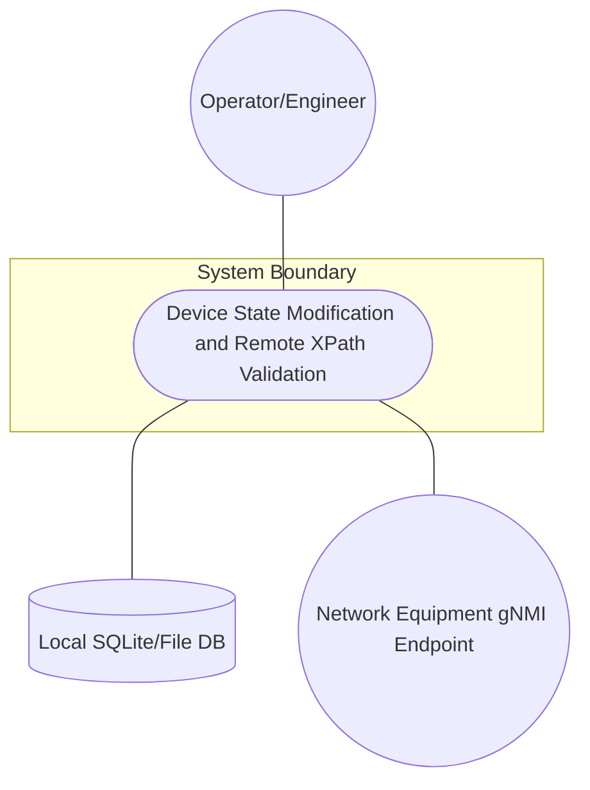
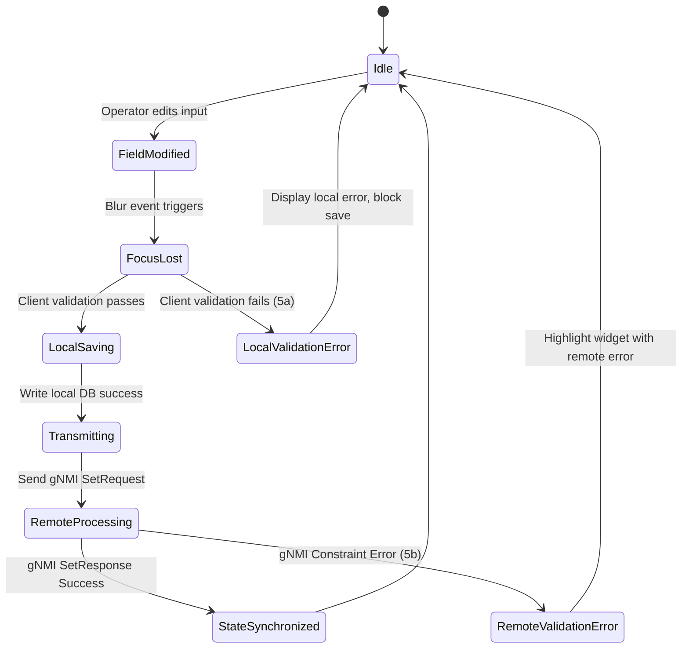

# Use Case: Device State Modification and Remote XPath Validation

## 1. Actors
- **Primary Actor:** Operator/Engineer
- **Secondary Actors:** Local SQLite/File DB, Network Equipment gNMI Endpoint

## 2. Preconditions
- The dynamic PropertyGrid is populated with data-bound inputs mapping to absolute XPaths.
- gNMI transport channel is open and active.

## 3. Trigger
Operator modifies an input property value in the PropertyGrid and shifts keyboard/mouse focus away from the input widget (blur event).

## 4. Main Success Scenario (Basic Flow)
1. Operator modifies a form field value (e.g., changes MTU or admin-status).
2. Operator shifts focus (focus-loss / blur event).
3. The UI widget performs declarative client-side validation check.
4. UI component triggers `onSave` callback, saving the state to the local database repository.
5. The application packages the edit using the attribute's absolute YANG XPath as the key.
6. The update is wrapped in a gNMI SetRequest Protobuf envelope and sent to the network equipment.
7. The network equipment validates the request against its internal schema constraints (e.g. YANG must statements).
8. The equipment accepts the configuration, returns a gNMI SetResponse success status, and the UI displays node state as synchronized.

## 5. Alternate and Exception Flows
- **5a. Client-side input validation fails (Branches from step 3):**
  1. The UI detects that the input value violates client-side constraints (e.g. value is out of range).
  2. The UI blocks the `onSave` invocation, highlights the field in an error state, and logs validation details.
- **5b. Remote XPath validation constraint fails (Branches from step 7):**
  1. The network device rejects the update due to a constraint violation (e.g. YANG must statement fails).
  2. The network device returns a gNMI error payload containing the target XPath and error details.
  3. The client application interceptor captures the gNMI error response.
  4. The UI highlights the offending input widget, displays the remote device error message, and logs the XPath error to the console.

## 6. Postconditions (Guarantees)
- **Success Guarantee:** The modified device state is persisted locally, successfully accepted by the remote network equipment, and the UI updates the field status as synchronized.
- **Failure Guarantee:** Local/Remote databases roll back the change if rejected, the UI shows a visual error indicator on the invalid field, and the console displays the device-returned XPath constraint details.

## UML Diagrams
### Use Case Diagram

### State Machine Diagram

## 7. Operational Context
Ensures focus-loss auto-saving maps cleanly to gNMI SetRequests via absolute YANG XPaths, and handles downstream errors from device-side constraint validation.

## 8. Realization Matrix
### Required Features
- [ ] #44 - [Downstream Baseline Feature](https://github.com/gintatkinson/digital-pipeline-repo/blob/master/docs/features/feat-44-downstream-baseline.md) (Provides local SQLite persistence adapters)
- [ ] #55 - [Zero Code-Gen Dynamic PropertyGrid Adapter](https://github.com/gintatkinson/digital-pipeline-repo/blob/master/docs/features/feat-13-zero-codegen-grid.md) (Implements focus-loss listeners and local auto-saving)

## Source References
Structural Schema: `docs/designs/persistence-architecture-blueprint.md`
Normative Specification: `docs/designs/persistence-architecture-blueprint.md`
