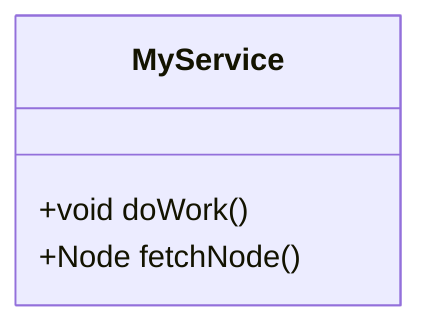
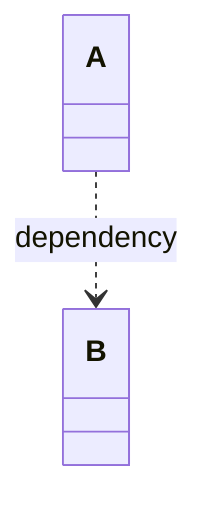

# Implementation Plan: Add Regression Tests for Linter Fixes (Issues 58-63)

This plan details adding regression tests to `tests/test_linter_reliability.py` to cover:
1. Programmatic `epics_dir` override (Issue #58)
2. Unbracketed return types default to multiplicity `[1]` (Issue #61)
3. Contextual codebase coverage checks for common words (Issue #62)
4. Restricting dotted link checks strictly to Mermaid blocks (Issue #63)

---

## 1. Proposed Changes

### Component: Pytest Suite

#### [MODIFY] [test_linter_reliability.py](file:///Users/perkunas/jail/digital-pipeline-repo/tests/test_linter_reliability.py)
Append the following regression test cases to the end of the file:
```python
def test_programmatic_epics_dir_override(tmp_path, base_config):
    # Setup base workspace
    ws_dir = setup_workspace(tmp_path, base_config)
    repo = WorkspaceRepository(str(ws_dir))
    
    # Create a custom epics directory
    custom_epics_dir = tmp_path / "custom_epics"
    os.makedirs(custom_epics_dir, exist_ok=True)
    with open(custom_epics_dir / "epic_valid.md", "w", encoding="utf-8") as f:
        f.write("# Epic 1\n\n## UML Diagrams\n```mermaid\nclassDiagram\nclass CustomClass {}\n```\n")
        
    from parity_auditor.validators.uml import UmlValidator
    validator = UmlValidator()
    
    # Call validate passing epics_dir programmatically
    global_classes = validator.build_global_classes(repo, os.path.join(ws_dir, "docs/features"), str(custom_epics_dir))
    assert "CustomClass" in global_classes

def test_unbracketed_return_multiplicity(tmp_path, base_config):
    ws_dir = setup_workspace(tmp_path, base_config)
    repo = WorkspaceRepository(str(ws_dir))
    
    # Define a feature spec with unbracketed void and single return methods
    features_dir = ws_dir / "docs" / "features"
    os.makedirs(features_dir, exist_ok=True)
    with open(features_dir / "feat-methods.md", "w", encoding="utf-8") as f:
        f.write("""# Feature: Methods
## UML Diagrams

""")
    from parity_auditor.validators.uml import UmlValidator
    validator = UmlValidator()
    errors = validator.validate(repo, epics_dir=str(ws_dir / "docs/epics"))
    # Verify no multiplicity errors are raised on unbracketed returns
    mult_errors = [e for e in errors if "missing a multiplicity" in e]
    assert not mult_errors, f"Expected no multiplicity errors on unbracketed returns, but got: {mult_errors}"

def test_common_word_coverage_context(tmp_path, base_config):
    # Define a schema with a class having common properties 'id' and 'name'
    schemas = {
        "user.yang": """
        module user {
            container User {
                leaf id { type string; }
                leaf name { type string; }
            }
        }
        """
    }
    # 1. Setup workspace with codebase having 'id' and 'name' strictly inside comments
    flutter_files_invalid = {
        "widgets/user_card.dart": "// This is comment containing id and name"
    }
    ws_dir_invalid = setup_workspace(tmp_path / "invalid", base_config, schemas=schemas, flutter_files=flutter_files_invalid)
    repo_invalid = WorkspaceRepository(str(ws_dir_invalid))
    validator = SchemaMappingValidator()
    errors_invalid = validator.validate(repo_invalid)
    # Must fail because id and name are only in comments
    assert any("id" in err or "name" in err for err in errors_invalid)

    # 2. Setup workspace with codebase having 'id' and 'name' in valid code contexts
    flutter_files_valid = {
        "widgets/user_card.dart": "class User { final String id; final String name; User({required this.id, required this.name}); }"
    }
    ws_dir_valid = setup_workspace(tmp_path / "valid", base_config, schemas=schemas, flutter_files=flutter_files_valid)
    repo_valid = WorkspaceRepository(str(ws_dir_valid))
    errors_valid = validator.validate(repo_valid)
    # Must pass because id and name are present in code
    assert not errors_valid, f"Expected no errors, but got: {errors_valid}"

def test_mermaid_prose_dotted_link(tmp_path, base_config):
    ws_dir = setup_workspace(tmp_path, base_config)
    repo = WorkspaceRepository(str(ws_dir))
    
    # Feature spec with dotted-style link description in markdown prose, but valid diagram
    features_dir = ws_dir / "docs" / "features"
    os.makedirs(features_dir, exist_ok=True)
    with open(features_dir / "feat-prose.md", "w", encoding="utf-8") as f:
        f.write("""# Feature: Prose
Please refer to this: A ..> B for description.
See [Standard Link](http://example.com) for details.

## UML Diagrams

""")
    from parity_auditor.validators.uml import UmlValidator
    validator = UmlValidator()
    errors = validator.validate(repo, epics_dir=str(ws_dir / "docs/epics"))
    # Verify no dotted link errors are raised from the prose
    link_errors = [e for e in errors if "dotted link" in e]
    assert not link_errors, f"Expected no link errors from prose, but got: {link_errors}"
```

---

## 2. Verification Plan

### Automated Tests
* Run the pytest suite to verify all new regression tests compile and pass:
  `python3 -m pytest tests/`
