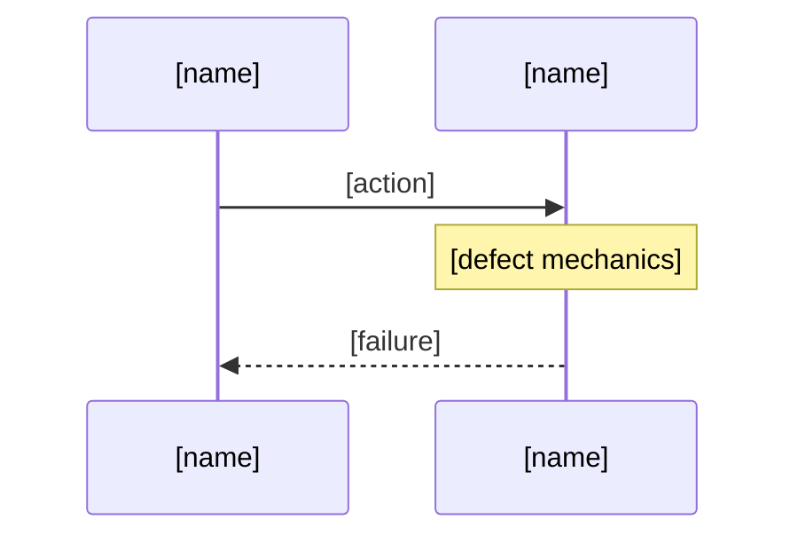
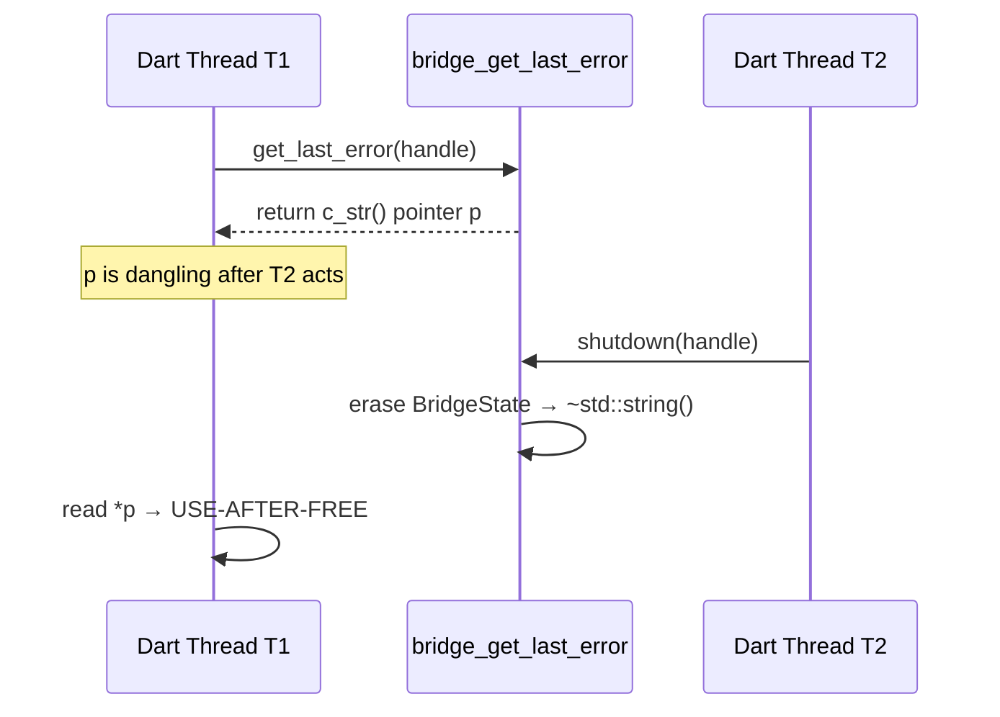

<!-- Copyright 2026. All rights reserved. -->

---
name: adversarial-code-auditor
version: "3.1"
description: "Pre-emptive adversarial audit against four correctness risk pillars."
compatibility: "Requires gh CLI and git."
metadata:
  title: "Adversarial Code Auditor"
  category: auditing
  risk: low
---

# Adversarial Code Auditor

## 1. Reference

### 1.1 Architecture

Subagent receives: file path, pillar name, mode, repo name. Subagent reads this file, audits the target file, produces compliant output, self-verifies, files via `gh issue create --body-file`, returns URLs. Coordinator collects URLs. Coordinator never touches body text.

### 1.2 When to Use

5+ open bugs in related files form a cluster. User provides file paths. Single runtime bugs → debug-protocol. Spec gaps → spec-implementation-auditor.

### 1.3 Pillars

| Pillar | Focus |
|--------|-------|
| Memory Safety | UAF, double-free, dangling pointers, buffer overflow, signed/unsigned wrap, C++ exception across FFI, NativeFinalizer, mutex/pointer lifetime |
| Resource Lifecycle | Missing dispose(), cache eviction, sync I/O on UI thread, GC churn, socket leaks, HTTP timeouts, GPU overdraw |
| Concurrency | ChangeNotifier post-disposal, async races, state mutation in build(), re-entrant async, missing _disposed, TOCTOU |
| Test Integrity | FFI/DB-dependent tests, sleep loops, bare assert(), missing testWidgets, duplicated fakes, flaky assertions |

### 1.4 Severity

| Severity | Rule |
|----------|------|
| **Critical** | Crash, corruption, or resource leak from code paths reachable by current callers. |
| **Important** | Wrong behavior, degradation under load, correctness risk in edge cases. |
| **Suggestion** | Forward-looking risk, missing guard for future code, test gap, dead code. NOT a current bug. |
| **Nitpick** | Style, naming. No correctness impact. |

**Constraints:** "No validation" is false if any guard exists. Read code before claiming absence. Stubs that cannot throw have no exception risk. Forward-looking = Suggestion.

### 1.5 UML

Critical and Important findings require a Mermaid diagram in Section 4. Select type:

| Defect | Diagram |
|--------|---------|
| UAF, double-free, dangling pointer | sequenceDiagram |
| Exception crossing FFI | sequenceDiagram |
| Buffer overflow, signed wrap | classDiagram |
| Missing dispose, leak on error path | sequenceDiagram |
| Cache eviction, LRU violation | stateDiagram-v2 |
| ChangeNotifier post-disposal | sequenceDiagram |
| TOCTOU, async race | sequenceDiagram |
| FFI-dependent test, missing mock | classDiagram |

Must use ```mermaid fenced blocks with valid syntax. No ASCII art. Named lifelines. alt/loop fragments for branches. No isolated classes. stateDiagram-v2 syntax. Trace to file:line from Section 3.

## 2. Output Format

Every finding MUST produce output matching this skeleton character-for-character in section headers and field labels. Replace `[...]` placeholders with real content. Do not change the structure.

```
## 1. Context and References
- **File**: `[path]:[line-line]`
- **Pillar**: [Memory Safety | Resource Lifecycle | Concurrency | Test Integrity]
- **Symptom**: [description]

## 2. Root Cause Analysis (5 Whys)
1. **Why [symptom]?** Because [reason].
2. **Why [reason]?** Because [deeper].
3. **Why [deeper]?** Because [deeper still].
4. **Why [deeper still]?** Because [design cause].
5. **Why [design cause]?** Because [root cause].

## 3. Correctness Analysis
[Trace data flow from trigger to failure. Name the invariant violated. Cite file:line references.]

## 4. UML Diagrams
[MANDATORY for Critical/Important. For Suggestion/Nitpick: "N/A — [severity] severity."]



[Fill real names. This is mermaid syntax inside a fenced block. No ASCII art.]

## 5. Affected Callers / Downstream Impact
- [caller] — [how affected]

## 6. Proposed Correction
```[lang]
[code]
```

## 7. Relationship to Existing Issues
- **Discovered in audit** — new finding.

## Audit Source
Adversarial [Pillar] Audit

SEVERITY: [Critical | Important | Suggestion | Nitpick]
FILE_LOCATION: [path]:[line-line]
```

## 3. Protocol

Subagents follow these steps in order. No deviation.

### Step A — Read

1. Read this skill file in full.
2. Read `[FILE_PATH]`.
3. Read `.pipeline/constitution.md`.
4. For Dart files, read `.pipeline/profiles/flutter.md`.

### Step B — Audit

1. Scan every line of `[FILE_PATH]` through the `[PILLAR]` focus.
2. For each potential defect, answer:
   - What exact `file:line` range contains the defect?
   - Is it reachable from current callers? (Critical) or future-only? (Suggestion)
   - Does the code already have a guard? If yes, acknowledge it.
   - Is it a stub that cannot throw or allocate? If yes, do not flag.
3. Classify severity using Section 1.4.
4. If Critical or Important, select diagram type from Section 1.5.

### Step C — Write

1. For EVERY finding, produce one issue body.
2. Copy the skeleton from Section 2 exactly. Fill in `[...]` placeholders with real values.
3. Section headers and field labels must match the skeleton character-for-character.
4. Section 1: Three bullet points with bold labels. Never collapse into one line.
5. Section 2: Exactly five `**Why [text]?** Because [text].` lines.
6. Section 4: Valid ```mermaid block (Critical/Important) or "N/A — [severity] severity." (Suggestion/Nitpick). No ASCII art.
7. Section 6: Triple-backtick code block with language tag.
8. End with SEVERITY and FILE_LOCATION lines.

### Step D — Verify

Before filing, run these checks on the body. All must pass.

| # | Check | How to verify |
|---|-------|---------------|
| 1 | Section headers | Count `^## [1-7]\.` must equal 7 |
| 2 | Audit Source line | Contains `## Audit Source` |
| 3 | Severity line | Matches `SEVERITY: (Critical|Important|Suggestion|Nitpick)` |
| 4 | File location line | Matches `FILE_LOCATION: [path]:[line]` |
| 5 | Section 1 bullets | Three lines matching `^- \*\*(File|Pillar|Symptom)\*\*:` |
| 6 | Section 2 Whys | Five lines matching `^[1-5]\. \*\*Why .*\?\*\* Because .*` |
| 7 | Section 4 Critical/Important | Contains ```mermaid block with valid diagram |
| 8 | Section 4 Suggestion/Nitpick | Contains `N/A — ` |
| 9 | Balanced code blocks | Even number of ``` occurrences |
| 10 | No ASCII art UML | Does NOT contain unescaped `->>` or `→` outside mermaid blocks |
| 11 | Title-format | Matches `\[AUDIT\] \[[file.ext]\]: [description]` |

If any check fails, fix the body and re-verify. Do NOT file until all checks pass.

### Step E — File

1. Write the verified body to `/tmp/gh_body.md`.
2. Run: `gh issue create --repo [REPO] --title "[AUDIT] [file.ext]: [description]" --label "bug" --body-file /tmp/gh_body.md`
3. Title format: `[AUDIT] [filename.ext]: [Brief description]`
4. If mode is `bug-based` and finding confirms a known issue, use `gh issue comment` instead of `gh issue create`.
5. Sleep 1 second between issues.
6. Return: issue URLs with severities.

## 4. Example — Complete Compliant Output

```
## 1. Context and References
- **File**: `cesium_native_bridge/src/bridge.cpp:56-61`
- **Pillar**: Memory Safety
- **Symptom**: Dart FFI caller reads garbage or crashes after calling bridge_get_last_error when another thread concurrently calls bridge_shutdown on the same handle.

## 2. Root Cause Analysis (5 Whys)
1. **Why does the Dart VM crash?** Because it dereferences a pointer whose backing memory was freed.
2. **Why was the memory freed?** Because bridge_get_last_error returns c_str() and releases the mutex; a concurrent bridge_shutdown erases the BridgeState, destroying the std::string.
3. **Why return a raw pointer to internal state?** Because the API was designed for zero-copy convenience.
4. **Why is that assumption violated?** Because no ownership protocol or lifetime contract exists across the FFI boundary.
5. **Why was no contract designed?** Because the C FFI pattern chose raw C string returns without ownership semantics.

## 3. Correctness Analysis
Thread T1 calls bridge_get_last_error (line 56), acquires g_statesMutex (line 57), evaluates c_str() on line 60 producing pointer p. The lock_guard destructor at line 61 releases the mutex. Thread T2 enters bridge_shutdown (line 46), acquires the mutex (line 47), erases the map entry (line 48). The unique_ptr destructor frees BridgeState, ~std::string() deallocates the buffer backing p. T1 dereferences p — use-after-free. Invariant violated: pointer returned across FFI must remain valid at least until the next bridge call.

## 4. UML Diagrams


## 5. Affected Callers / Downstream Impact
- Dart FFI caller getLastError() — receives dangling pointer after concurrent shutdown
- Any async error-handling path calling getLastError after tile load failure

## 6. Proposed Correction
```cpp
int32_t bridge_get_last_error(bridge_handle_t handle, char* out, int32_t size) {
  if (!out || size <= 0) return BRIDGE_ERR_MEMORY;
  std::lock_guard<std::mutex> lock(g_statesMutex);
  auto it = g_states.find(handle);
  const char* src = (it == g_states.end()) ? "Invalid handle" : it->second->lastError.c_str();
  std::strncpy(out, src, static_cast<size_t>(size) - 1);
  out[size - 1] = '\0';
  return BRIDGE_OK;
}
```

## 7. Relationship to Existing Issues
- **Discovered in audit** — new finding.

## Audit Source
Adversarial Memory Safety Audit

SEVERITY: Critical
FILE_LOCATION: cesium_native_bridge/src/bridge.cpp:56-61
```

## 5. Coordinator Dispatch

The ONLY text sent to each subagent. Only the three bracketed fields differ.

```
Execute adversarial-code-auditor skill.

Read skills/adversarial-code-auditor/SKILL.md in full.
Follow the Protocol (Section 3) exactly — Read, Audit, Write, Verify, File.

FILE_PATH: [FILE_PATH]
PILLAR: [PILLAR]
MODE: [MODE]
REPO: [REPO]

Return issue URLs with severities. PROCEED
```
