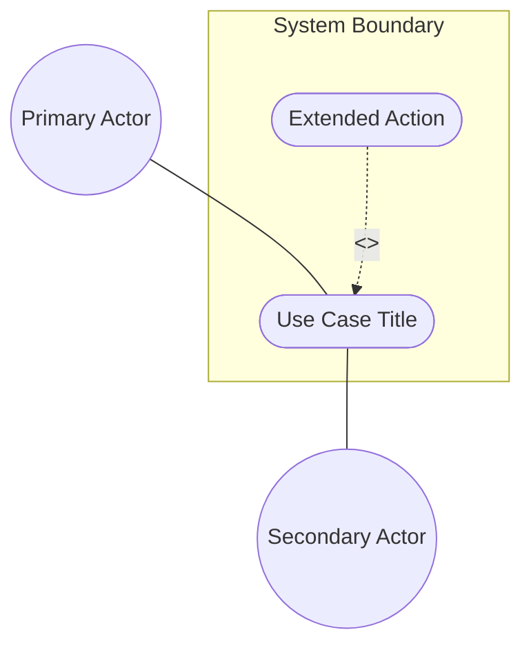
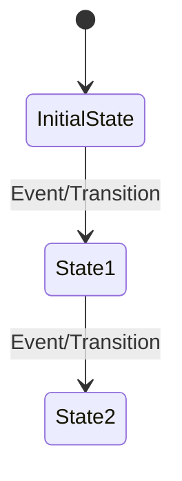

<!-- Copyright Gint Atkinson, gint.atkinson@gmail.com -->

---
name: spec-usecase-engineering
description: "Extracts formal UML System Use Cases from normative specification documents using OOA/OOD methodology. Use when you need to derive Actors, Preconditions, Main Success Scenarios, and Realization Matrices linking Use Cases to User Stories and Features."
compatibility: "Requires issue tracker CLI and git. Works with modern agentic development environments."
metadata:
  title: "Specification Use Case Engineering (System Interaction)"
  category: architecture
  risk: low
  source: custom
  version: "2.0"
---

# Specification Use Case Engineering (System Interaction)

This skill enables a sub-agent to autonomously read a normative specification document and extract its high-level deployment patterns into formal, UML OOA/OOD compliant System Use Cases (e.g., Alistair Cockburn style). These Use Cases represent overarching system behavior and state transitions, and they map down to the granular User Stories and Features.

## Execution Trigger
You should invoke this skill ONLY after the behavioral User Stories have been extracted using the `spec-user-story-engineering` skill.

## Step 1: Context Ingestion
1. Ingest the target normative specification document.
2. Target the broad architectural and operational chapters (e.g., "Deployment Scenarios", "System Architecture", "Operational Considerations").
3. Identify the major functional groupings of behavior that define end-to-end system interactions.

## Step 2: Isolated Use Case Modeling (Subagent Dispatch Loop)

1. **Identify Use Cases:** Scan the specification architecture/deployment chapters and structural schemas to identify all required System Use Cases (including mandatory behavioral triggers). Compile the list of target Use Cases to be engineered.
2. **Dispatch Use Case Subagent:** For each identified Use Case, invoke a **new, fresh subagent with an isolated context**. Pass ONLY the specific system interaction text, relevant User Stories, Feature specs, and the Use Case template. The subagent must have no visibility or knowledge of other Use Cases.
3. **Execution within Subagent Context:**
   - **Use Case Modeling:** Model a formal Use Case following standard UML Object-Oriented Analysis and Design (OOA/OOD) formats:
     - **Primary & Secondary Actors:** The internal/external entities interacting with the system.
     - **Preconditions:** The exact state the system/objects must be in before the Use Case begins.
     - **Trigger:** The specific event or message that initiates the Use Case.
     - **Main Success Scenario (Basic Flow):** The sequential, step-by-step object interactions that lead to a successful outcome. Steps must be clear and numbered.
     - **Alternate/Exception Flows:** Variations in state, error conditions, or alternative paths.
       - *Constraint-to-Flow Parity*: For each Use Case, identify all features referenced in the `Realization Matrix`. Read the `Validation & Constraints` sections of those features and count the total number of validation/negative constraints. You MUST generate a dedicated Alternate/Exception flow for **every single** validation constraint defined across those features.
       - *Minimum Floor*: If the total count of constraints across all referenced features is less than 2, you must still generate at least 2 Alternate/Exception flows as a minimum floor.
       - *Branching Point*: Each flow MUST explicitly identify which step of the Main Success Scenario it branches from.
       - *Flow Requirements*: Each flow must contain at least 2 numbered steps of system/actor interaction.
       - *Guarantees*: State the resulting state changes, rollback operations, or notifications.
     - **Postconditions (Success/Failure Guarantee):** The final guaranteed state of the system/objects. Define both a Success Guarantee and a Failure/Abort Guarantee.
     - **UML Diagrams**: Every Use Case MUST include:
       - *UML Use Case Diagram*: Illustrate system boundary, actors, relationships, and linkages. Group all use case nodes inside system boundary, place actors outside. Use case nodes must be stadium/oval shapes. Actor links must be undirected associations. Dotted/dashed arrows must use correct, parsable syntax.
       - *UML State Machine Diagram*: Show transition logic from preconditions to final postconditions.
       - Only UML diagrams are allowed.
   - **The Realization Matrix (User Story/Feature Linking):**
     - Determine which User Stories and Features are required to fulfill this specific System Use Case.
     - Construct a `## Realization Matrix` containing a markdown tasklist of these intersecting links referencing BOTH the Issue ID and the absolute URL.
     - Every checklist item in the matrix MUST include a concise parenthetical justification explaining the semantic linkage.
   - **Markdown Generation:** Write the Use Case as a local markdown file (e.g., `docs/use-cases/uc-01-register-core-entity.md`).
4. **Return Control:** The subagent completes the task and returns control to the worker agent.

## Step 4: Markdown Generation
Create a new file in `docs/use-cases/uc-[XX]-[name].md` (zero-padded, dash-separated, e.g., `uc-01-register-core-entity.md`). Format strictly:

```markdown
---
title: "[Use Case Title]"
type: "use-case"
generation_mode: "subagent"
spec_source: "[Spec Reference]"
---

# Use Case: [Title]

## Parent Epic
- [ ] #[EpicIssueID] - [Epic Title]([Repository Base URL]/<blob_path>/[Branch Name]/docs/epics/epic-XX-name.md) (semantic linkage justification)

## 1. Actors
- **Primary Actor:** [Actor Name]
- **Secondary Actors:** [Actor Names]

## 2. Preconditions
- [Object/System State Precondition 1]
- [Object/System State Precondition 2]

## 3. Trigger
[The event or message that initiates the Use Case]

## 4. Main Success Scenario (Basic Flow)
1. [Actor] does [Action]
2. [System/Object] responds by [Action/State Change]
3. [Step 3...]

## 5. Alternate and Exception Flows
- **5a. [Condition] (Branches from Basic Flow step [X]):**
  1. [System/Object] does [Action]
  2. [System/Object] transitions to [State] and returns to step [Y] of the Main Success Scenario.
- **5b. [Exception] (Branches from Basic Flow step [X]):**
  1. [System/Object] detects [Error]
  2. [System/Object] aborts the transaction, rolls back [State], and notifies [Actor].

## 6. Postconditions (Guarantees)
- **Success Guarantee:** [Final Object/System State on success]
- **Failure Guarantee:** [Final Object/System State on failure/abort/rollback]

## UML Diagrams
### Use Case Diagram


### State Machine Diagram


## 7. Operational Context
[Verbatim deployment scenarios quoted from the specification]

## 8. Realization Matrix
### Required User Stories
- [ ] #[IssueID] - [User Story Title]([Repository Base URL]/<blob_path>/[Branch Name]/docs/user-stories/us-XX-name.md) (semantic linkage justification)
### Required Features
- [ ] #[IssueID] - [Feature Title]([Repository Base URL]/<blob_path>/[Branch Name]/docs/features/feat-XX-name.md) (semantic linkage justification)

## Source References
Structural Schema: [Target Schema File](link-to-schema)
Normative Specification: [Normative Specification](link-to-specification)
```

## Step 5: Zero-Fault Backlog Synchronization
1. Commit and push the Markdown files to the remote repository.
2. Verify the `use-case` label exists in the tracker repository, bootstrapping it if necessary.
3. **Duplicate Detection:** Before creating, query the active tracker provider for all existing use case issues to check if an issue with an identical or semantically equivalent title already exists. If found, skip creation and reuse the existing Issue ID.
4. Register the Use Case issue natively with the active tracker provider.
5. Verify the creation and return the generated issue URLs/IDs to the Orchestrator or User.
