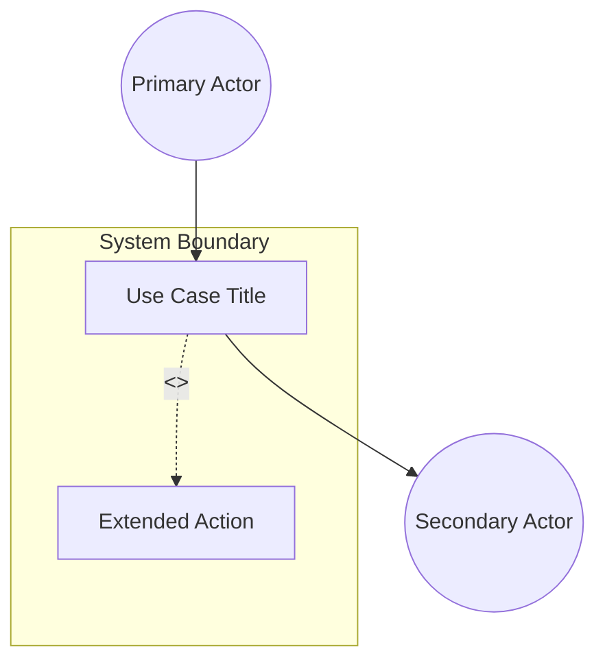
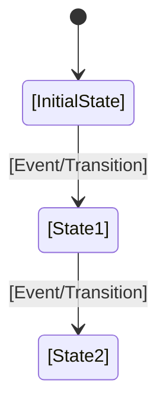

<!-- Copyright Gint Atkinson, gint.atkinson@gmail.com -->

---
name: spec-usecase-engineering
description: "Extracts formal UML System Use Cases from normative specification documents using OOA/OOD methodology. Use when you need to derive Actors, Preconditions, Main Success Scenarios, and Realization Matrices linking Use Cases to User Stories and Features."
compatibility: "Requires gh CLI and git. Works with Claude Code, Gemini CLI, Cursor, Copilot, Cascade."
metadata:
  title: "Specification Use Case Engineering (System Interaction)"
  category: architecture
  risk: low
  source: custom
  version: "1.1"
---

# Specification Use Case Engineering (System Interaction)

This skill enables a sub-agent to autonomously read a normative specification document and extract its high-level deployment patterns into formal, UML OOA/OOD compliant System Use Cases (e.g., Alistair Cockburn style). These Use Cases represent overarching system behavior and state transitions, and they map down to the granular User Stories and Features.

## Execution Trigger
You should invoke this skill ONLY after the behavioral User Stories have been extracted using the `spec-user-story-engineering` skill.

## Step 1: Context Ingestion
1. Ingest the target normative specification document.
2. Target the broad architectural and operational chapters (e.g., "Deployment Scenarios", "System Architecture", "Operational Considerations").
3. Identify the major functional groupings of behavior that define end-to-end system interactions.

## Step 2: UML OOA/OOD Use Case Modeling
For each major system interaction, model a formal Use Case following standard UML Object-Oriented Analysis and Design (OOA/OOD) formats:
1. **Primary & Secondary Actors:** The internal/external entities interacting with the system.
2. **Preconditions:** The exact state the system/objects must be in before the Use Case begins.
3. **Trigger:** The specific event or message that initiates the Use Case.
4. **Main Success Scenario (Basic Flow):** The sequential, step-by-step object interactions that lead to a successful outcome. Steps must be clear and numbered.
5. **Alternate/Exception Flows:** Variations in state, error conditions, or alternative paths. You MUST document *at least two* detailed Alternate/Exception flows for every Use Case.
   - **Branching Point**: Each flow MUST explicitly identify which step of the Main Success Scenario it branches from.
   - **Detail Level**: Contain at least 2 numbered steps of system/actor interaction.
   - **Guarantees**: State the resulting state changes, rollback operations, or notifications.
6. **Postconditions (Success/Failure Guarantee):** The final guaranteed state of the system/objects. You must define both a Success Guarantee and a Failure/Abort Guarantee.
7. **UML Use Case & State Machine Diagrams:** Every Use Case MUST include:
   - A **UML Use Case Diagram** (using Mermaid `graph TD` structured with a system boundary `subgraph` and actors) illustrating the system boundary, actors (both primary and secondary), relationships, and any `<<include>>` or `<<extend>>` linkages.
   - A **UML State Machine Diagram** (using Mermaid `stateDiagram-v2`) showing transition logic from preconditions to final postconditions.
   - Only UML diagrams are allowed; ERDs are strictly forbidden.
   - **Mermaid Dotted Link Label Syntax Constraint:** Dotted/dashed arrows with labels (e.g., for `<<include>>` or `<<extend>>` relationships) MUST use the `-. label .->` syntax (e.g. `UC -. <<include>> .-> UC_Sub`). Do NOT use the pipe syntax (like `-.->|label|` or `-.-->|label|`), as it is invalid Mermaid syntax for dotted lines and will cause parsing and rendering failures on GitHub.

### Behavioral Extraction Triggers (Mandatory Use Cases)
An agent MUST extract a separate, dedicated System Use Case (in addition to standard CRUD location management) if the normative text or YANG schema meets any of the following triggers:
- **Algorithmic/Calculation Trigger**: If the specification defines any mathematical formula, equation, conversion, or derivation, it MUST have a dedicated Use Case mapping the inputs, steps of the calculation flow, and potential edge-case validation failure paths.
- **Temporal/State Lifecycle Trigger**: If the schema defines temporal attributes (`timestamp`, `valid-until`) or implies state-decay lifecycles, it MUST have a dedicated Use Case detailing the expiry check flows, transition to expired/stale state, and postconditions for stale data access.


## Step 3: The Realization Matrix (User Story/Feature Linking)
A System Use Case is realized by User Stories and structural Features.
1. Execute `gh issue list --label "user-story" --state "all" --json number,title,body` and `gh issue list --label "feature" --state "open" --json number,title` to pull the existing inventory.
2. **Perform Semantic Analysis**: Inspect both titles and content bodies of stories to perform mapping rather than simple title-only matching.
3. Determine which User Stories and Features are required to fulfill this specific System Use Case.
4. Construct a `## Realization Matrix` containing a markdown tasklist of these intersecting links referencing BOTH the Issue ID and the absolute GitHub URL of the feature/user-story documents (relative links like `../features/...` resolve incorrectly on GitHub issues and cause 404 errors). You MUST dynamically determine the remote repository URL by running `git remote get-url origin` and construct the absolute link pointing to the file on the current branch (e.g., `- [ ] #41 - [Feature 01 Title](https://github.com/owner/repo/blob/branch_name/docs/features/feat-01.md)`). **Every checklist item in the matrix MUST include a concise parenthetical justification explaining the semantic linkage (e.g. `(provides coordinates schema)` or `(realizes the authentication scenario)`).**

## Step 4: Markdown Generation
Create a new file in `docs/use-cases/uc-[XX]-[name].md` (zero-padded, dash-separated, e.g., `uc-01-register-geo-location.md`). Format strictly:

```markdown
---
title: "[Use Case Title]"
type: "use-case"
spec_source: "[Spec Reference]"
---

# Use Case: [Title]

## 1. Actors
- **Primary Actor:** [Actor Name]
- **Secondary Actors:** [Actor Names]

## 2. Preconditions
- [Object/System State Precondition 1]
- [Object/System State Precondition 2]

## 3. Trigger
[The event or message that initiates the Use Case]

## 4. Main Success Scenario (Basic Flow)
1. [Actor] does [Action]
2. [System/Object] responds by [Action/State Change]
3. [Step 3...]

## 5. Alternate and Exception Flows
- **5a. [Condition] (Branches from Basic Flow step [X]):**
  1. [System/Object] does [Action]
  2. [System/Object] transitions to [State] and returns to step [Y] of the Main Success Scenario.
- **5b. [Exception] (Branches from Basic Flow step [X]):**
  1. [System/Object] detects [Error]
  2. [System/Object] aborts the transaction, rolls back [State], and notifies [Actor].

## 6. Postconditions (Guarantees)
- **Success Guarantee:** [Final Object/System State on success]
- **Failure Guarantee:** [Final Object/System State on failure/abort/rollback]

## UML Diagrams
### Use Case Diagram


### State Machine Diagram


## 7. Operational Context
[Verbatim deployment scenarios quoted from the specification]

## 8. Realization Matrix
### Required User Stories
- [ ] #[IssueID] - [User Story Title](https://github.com/owner/repo/blob/branch_name/docs/user-stories/us-XX-name.md) (semantic linkage justification)
### Required Features
- [ ] #[IssueID] - [Feature Title](https://github.com/owner/repo/blob/branch_name/docs/features/feat-XX-name.md) (semantic linkage justification)

## Source References
YANG Schema: [Link to structural schema, e.g., ietf-geo-location@2022-02-11.yang](https://github.com/YangModels/yang/blob/main/standard/ietf/RFC/ietf-geo-location%402022-02-11.yang)
Normative Specification: [Link to normative specification, e.g., RFC 9179 Geographic Location](https://datatracker.ietf.org/doc/rfc9179/)
```

## Step 5: Zero-Fault GitHub Synchronization
1. Commit and push the Markdown files to the remote repository.
2. You MUST verify the `use-case` label exists in the repository. Run `gh label create "use-case" --force`. Do not bypass this.
3. **Duplicate Detection:** Before creating, run `gh issue list --label "use-case" --state "all" --json number,title` and check if an issue with an identical or semantically equivalent title already exists. If found, skip creation and reuse the existing Issue ID.
4. Create the issue natively in GitHub. You MUST explicitly bind the label:
   `gh issue create --title "[Use Case Title]" --body-file [path/to/markdown.md] --label "use-case"`
5. Verify the creation and return the generated GitHub URLs to the Orchestrator or User.
