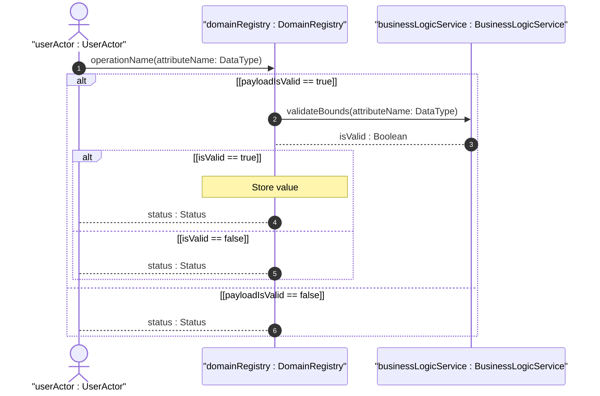
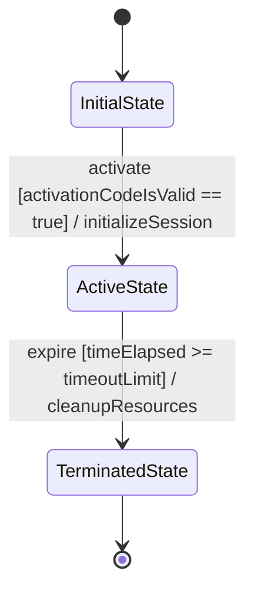

<!-- Copyright Gint Atkinson, gint.atkinson@gmail.com -->

---
name: spec-user-story-engineering
description: "Extracts BDD User Stories from normative specification documents using OOA/OOD modeling. Use when you need to derive behavioral scenarios (Given-When-Then) from protocol specs and matrix them against existing Feature issues in the repository."
compatibility: "Requires issue tracker CLI and git. Works with modern agentic development environments."
metadata:
  title: "Specification User Story Engineering (Behavioral Extraction)"
  category: architecture
  risk: low
  source: custom
  version: "2.0"
---

# Specification User Story Engineering (Behavioral Extraction)

This skill enables a sub-agent to autonomously read a normative specification document (e.g., domain-specific specifications and API documentation) and extract its behavioral deployment scenarios into pure Behavior-Driven Development (BDD) User Stories modeled according to Object-Oriented Analysis and Design (OOA/OOD) principles, linking them dynamically to structural features already defined in the repository.

## Execution Trigger
You should invoke this skill ONLY after the structural Features have been extracted using the `schema-specification-engineering` skill.

### Algorithmic & Calculation Story Extraction Trigger (Mandatory)
In addition to standard deployment scenarios, you MUST scan the specification and schema for any derived, computed, or calculated values (e.g. performing unit conversions, coordinate transformations, validation ranges, formulas, or elapsed time checks). For every calculated or derived value identified, you MUST extract a dedicated, mandatory User Story that details the calculations, formulas, or algorithmic transformations required, ensuring that these dynamic behaviors are fully captured.

### Temporal & Lifecycle Expiration Story Extraction Trigger (Mandatory)
In addition to standard deployment scenarios, you MUST scan the specification and schema for any temporal/lifecycle expirations, state-decay lifecycles, or timeout transitions (e.g. token expiration, data staleness, status-based data access rules, or lifecycle decay). For every temporal or lifecycle expiration identified, you MUST extract a dedicated, mandatory User Story detailing the transition to the expired state and any postconditions for accessing data in that state.

## Step 1: Context Ingestion (Operational Text & Schemas)
1. Ingest the target normative specification document AND the target structural schemas (e.g., structural or protocol schemas).
2. **Scan the structural schema definitions** (specifically node descriptions, comments, type restrictions, and validation constraints) to identify:
   - Any derived, calculated, or computed data fields.
   - Any mathematical formulas, equations, unit conversions, or derivations.
   - Any temporal attributes or state lifecycles.
3. Target and analyze the following operational chapters of the normative specification:
   - Introduction & Applicability
   - Deployment Scenarios
   - Operational Considerations
   - Security Considerations
   - Algorithmic, Calculation, or Derivation clauses

## Step 2: Isolated User Story Modeling (Subagent Dispatch Loop)

1. **Identify Scenarios & Triggers:** Analyze the specification chapters and structural schemas to determine all required deployment scenarios, calculations/derivations, and temporal/state lifecycles. Compile the list of target User Stories to be engineered.
2. **Dispatch User Story Subagent:** For each identified User Story, invoke a **new, fresh subagent with an isolated context**. Pass ONLY the specific operational text, relevant schema definitions, related Feature specs, and the User Story template. The subagent must have no visibility or knowledge of other User Stories.
3. **Execution within Subagent Context:**
   - **Behavioral Modeling:** Model the scenario as a formal User Story integrated with OOA/OOD principles:
     - Identify the Actor/Role (the object or entity initiating the action).
     - Formulate the core scenario using strict BDD syntax mapped to object interactions (`Given`/`When`/`Then` or `As a`/`I want to`/`So that`).
     - Map the story to specific Domain Objects (the structural schema entities affected).
     - **UML Sequence Diagram**: Include a **UML Sequence Diagram** (using Mermaid `sequenceDiagram`) illustrating the dynamic interaction between the Actor and specific Domain Objects.
       - *Lifeline Notation*: All sequence diagrams must use the standard UML lifeline notation `name : Classifier` or `: Classifier` (using Mermaid alias syntax: `actor userActor as "userActor : UserActor"` or `participant domainRegistry as "domainRegistry : DomainRegistry"`). Do not use naked classifier names or simple `Actor` names.
       - *Open Return Arrow*: Return/reply messages must use the open arrowhead (`-->` in Mermaid) instead of the filled/closed arrowhead (`-->>`).
       - *Return Value Signatures*: Return messages must represent assignments/return values (e.g. `isValid : Boolean`) rather than method/operation calls.
       - *Operation Matching*: Every call/message in a sequence diagram must map to a public operation/method (with camelCase signature and typed arguments) on the receiver lifeline's classifier in the class diagrams.
       - *Combined Fragment Guards*: Guards on conditional/looping blocks (e.g. `alt`, `loop`, `opt`) must be enclosed in standard UML square brackets `[guard]`.
       - *Validation Loops/Conditional Blocks*: Use Mermaid `alt` or `loop` blocks to explicitly illustrate input validation loops.
       - *Helper/Calculator Object Delegation*: Do not model the main container handling complex computations directly; delegate to specialized helper or utility objects.
     - **UML State Machine Diagram**: Include state transitions, guards, events, and actions using Mermaid `stateDiagram-v2` (mandatory if the story involves state transitions or lifecycle expirations).
       - *Notation*: States must be in PascalCase. Transitions must be annotated with `event [guard] / action` on the transition arrow. Use `[*]` for entry/exit points. Use `-. label .->` syntax for dotted links.
   - **The Cross-Cutting Matrix (Feature Linking):**
     - Inspect the provided structural features to determine exactly which of those `#IssueID`s are prerequisites for the current User Story.
     - Construct the `## Required Features` matrix containing a markdown tasklist of these intersecting links referencing BOTH the Issue ID and the absolute URL of the feature document.
     - Every checklist item in the matrix MUST include a concise parenthetical justification explaining the semantic linkage.
   - **Markdown Generation:** Write the User Story as a local markdown file (e.g., `docs/user-stories/us-01-register-entity.md`).
4. **Return Control:** The subagent completes the task and returns control to the worker agent.

## Step 4: Markdown Generation
Create a new file in `docs/user-stories/us-[XX]-[name].md` (zero-padded, dash-separated, e.g., `us-01-register-entity.md`). Format strictly:

```markdown
---
title: "[User Story Title]"
type: "user-story"
generation_mode: "subagent"
spec_source: "[Spec Reference]"
---

# User Story: [Title]

## Parent Epic
- [ ] #[EpicIssueID] - [Epic Title]([Repository Base URL]/<blob_path>/[Branch Name]/docs/epics/epic-XX-name.md) (semantic linkage justification)

## Domain Object Mapping
- **Primary Domain Objects:** [List affected structural schema entities]
- **Actor/Role:** [The object/entity initiating the action]

## BDD Scenario (OOA/OOD Realization)
**Given** [Initial system/object state]
**When** [Triggering action/event/message]
**Then** [Resulting system/object state]

*(Alternatively)*
**As a** [Actor]
**I want to** [Action]
**So that** [Outcome/State Change]

## UML Sequence Diagram


## UML State Machine Diagram
*(Mandatory if the story involves state transitions or lifecycle expirations)*


## Operational Context
[Verbatim operational constraints or deployment scenarios quoted from the specification]

## Required Features Matrix
- [ ] #[IssueID] - [Feature Title]([Repository Base URL]/<blob_path>/[Branch Name]/docs/features/feat-XX-name.md) (semantic linkage justification)
- [ ] #[IssueID] - [Feature Title]([Repository Base URL]/<blob_path>/[Branch Name]/docs/features/feat-XX-name.md) (semantic linkage justification)

## Source References
Structural Schema: [Target Schema File](link-to-schema)
Normative Specification: [Normative Specification](link-to-specification)
```

## Step 5: Zero-Fault Backlog Synchronization
1. Commit and push the Markdown files to the remote repository.
2. Verify the `user-story` label exists in the tracker repository, bootstrapping it if necessary.
3. **Duplicate Detection:** Before creating, query the active tracker provider for all existing user story issues to check if an issue with an identical or semantically equivalent title already exists. If found, skip creation and reuse the existing Issue ID.
4. Register the User Story issue natively with the active tracker provider.
5. Verify the creation and return the generated issue URLs/IDs to the Orchestrator or User.
