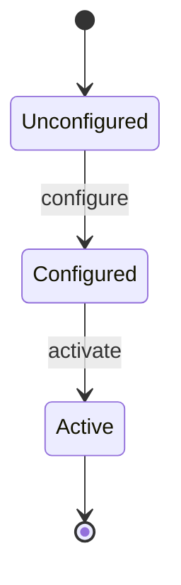

# Epic: Geographic Location Configuration & Tracking

## 1. Context
This Epic describes the core location tracking and coordinate systems used to manage asset positions.

## 2. Requirements & Checklist
- [ ] [feat-01-reference-frame](https://github.com/gintatkinson/digital-pipeline-repo/blob/refactor/test_project/docs/features/feat-01-reference-frame.md) (Need reference frame configuration)

## 3. Architecture

## System-Level UML Class Diagram
```mermaid
classDiagram
    class GeoLocation {
        +Decimal64 coordAccuracy[0..1] {fraction-digits=6}
        +Decimal64 heightAccuracy[0..1] {fraction-digits=6}
        +saveLocation() : Boolean[1]
    }
    class ReferenceFrame {
        +String alternateSystem[0..1]
        +String geodeticDatum[0..1]
    }
    class AstronomicalBody {
        <<enumeration>>
        EARTH
        MOON
        MARS
    }
    class Location
    <<choice>> Location
    class Ellipsoid {
        +Decimal64 latitude[1] {fraction-digits=16, range="-90.0..90.0"}
        +Decimal64 longitude[1] {fraction-digits=16, range="-180.0..180.0"}
        +Decimal64 height[0..1] {fraction-digits=6}
    }
    class Cartesian {
        +Decimal64 x[1] {fraction-digits=6}
        +Decimal64 y[1] {fraction-digits=6}
        +Decimal64 z[1] {fraction-digits=6}
    }
    class NamedLocation {
        +String locationName[1]
    }
    class Velocity {
        +Decimal64 vNorth[0..1] {fraction-digits=12}
        +Decimal64 vEast[0..1] {fraction-digits=12}
        +Decimal64 vUp[0..1] {fraction-digits=12}
    }
    class TemporalMetadata {
        +String timestamp[1]
        +String validUntil[0..1]
    }

    GeoLocation --> ReferenceFrame : referenceFrame
    GeoLocation *-- Location : location
    GeoLocation *-- Velocity : velocity
    GeoLocation *-- TemporalMetadata : temporalMetadata

    Location <|-- Ellipsoid
    Location <|-- Cartesian
    Location <|-- NamedLocation

    ReferenceFrame --> AstronomicalBody : astronomicalBody

    class UserInterface
    UserInterface --> GeoLocation : uses
```

## System State Machine Diagram


## 4. Operational Considerations
Operational guidelines for geodetic tracking.

## 5. Security & Governance
Privacy controls for location data.

## 6. Source References
RFC 9179.
