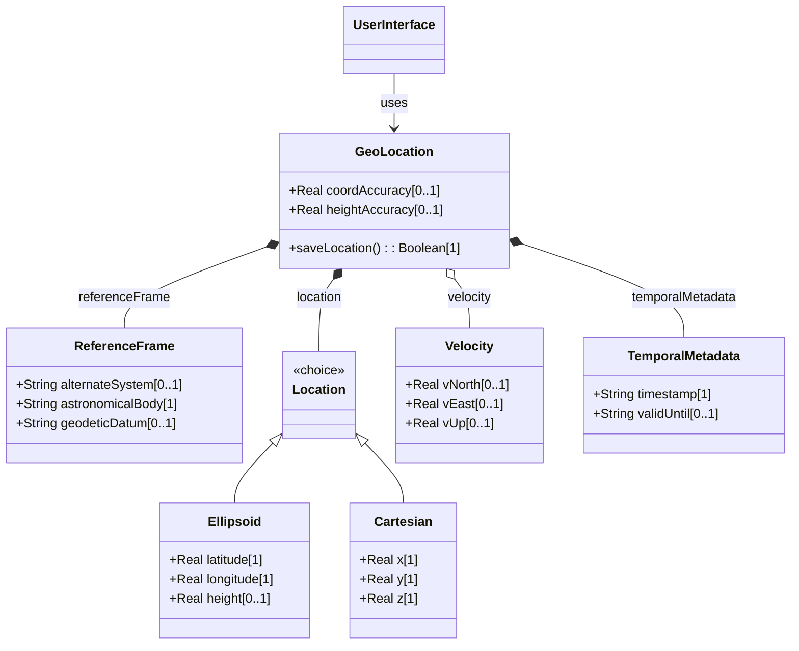
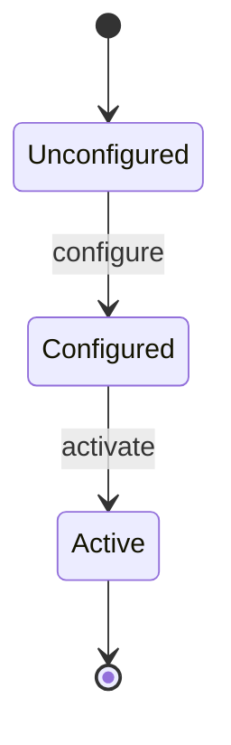

# Epic: Geographic Location Configuration & Tracking

## 1. Context
This Epic describes the core location tracking and coordinate systems used to manage asset positions.

## 2. Requirements & Checklist
- [ ] [feat-01-reference-frame](https://github.com/gintatkinson/digital-pipeline-repo/blob/refactor/test_project/docs/features/feat-01-reference-frame.md) (Need reference frame configuration)

## 3. Architecture

## System-Level UML Class Diagram

## System State Machine Diagram

## 4. Operational Considerations
Operational guidelines for geodetic tracking.

## 5. Security & Governance
Privacy controls for location data.

## 6. Source References
RFC 9179.
