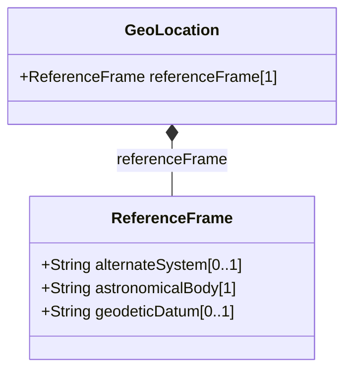

# Feature: Geographic Reference Frame Configuration

## Description
Configure geodetic reference systems.

## UML Class Diagram


## Interface Requirements

### 1. Test Data Shape
```json
{
  "alternate-system": "GPS",
  "astronomical-body": "earth",
  "geodetic-datum": "wgs-84"
}
```

### 4. Interactive Flow & States
Exception states when invalid inputs are received.
