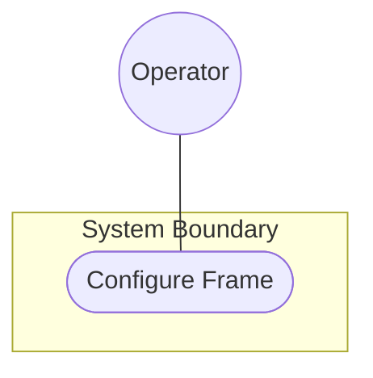
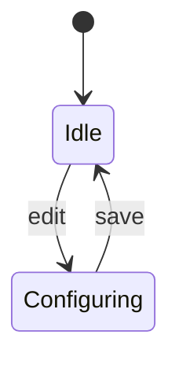

# Use Case: Configure Reference Frame

## 1. Actors
- Primary Actor: Operator
- Secondary Actor: Telemetry Engine

## 2. Preconditions
- System is unconfigured.

## 3. Trigger
- Operator logs in.

## 4. Main Success Scenario
1. Operator inputs reference frame data.
2. System validates and registers reference frame.

## 5. Alternate and Exception Flows
- **5a. Invalid Reference Frame**:
  1. System detects invalid coordinates.
  2. System displays error message.
- **5b. Timeout**:
  1. System fails to validate after 10 seconds.
  2. System terminates session.

## 6. Postconditions
- Reference frame configured.

## UML Diagrams

### Use Case Diagram

### State Diagram

## 8. Realization Matrix

### Required User Stories
- [x] [us-01-record-location](https://github.com/gintatkinson/digital-pipeline-repo/blob/refactor/test_project/docs/user-stories/us-01-record-location.md) (Operator story realizing frame logging)

### Required Features
- [x] [feat-01-reference-frame](https://github.com/gintatkinson/digital-pipeline-repo/blob/refactor/test_project/docs/features/feat-01-reference-frame.md) (Feature realizing frame config)
