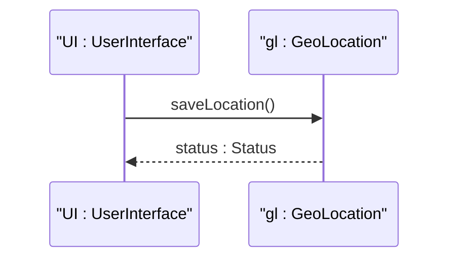

# User Story: Record Location Measurements

## Description
As a telemetry sensor,
I want to record the current position,
so that the controller knows where I am.

## BDD Scenarios
Given a sensor is active,
When it posts geographic coordinates,
Then the location is saved.

## UML Sequence Diagram

## Required Features Matrix
- [x] [feat-01-reference-frame](https://github.com/gintatkinson/digital-pipeline-repo/blob/refactor/test_project/docs/features/feat-01-reference-frame.md) (Need reference frame configured before recording coordinates)
